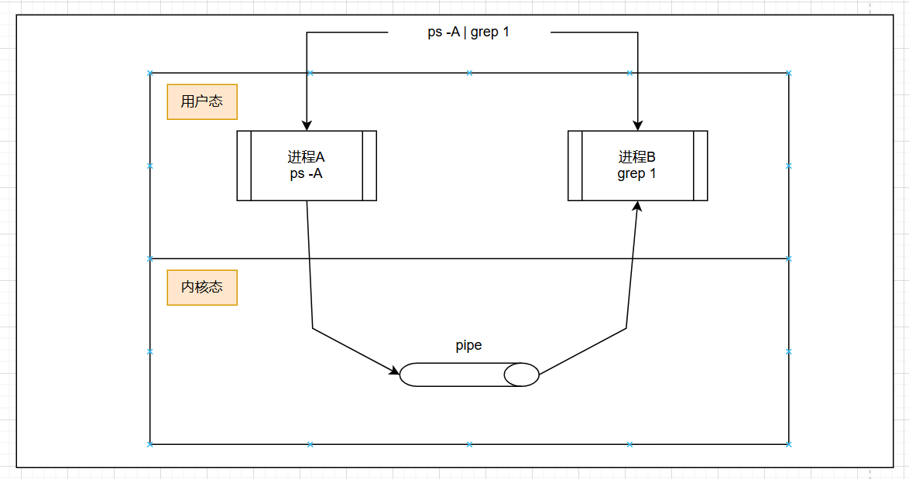
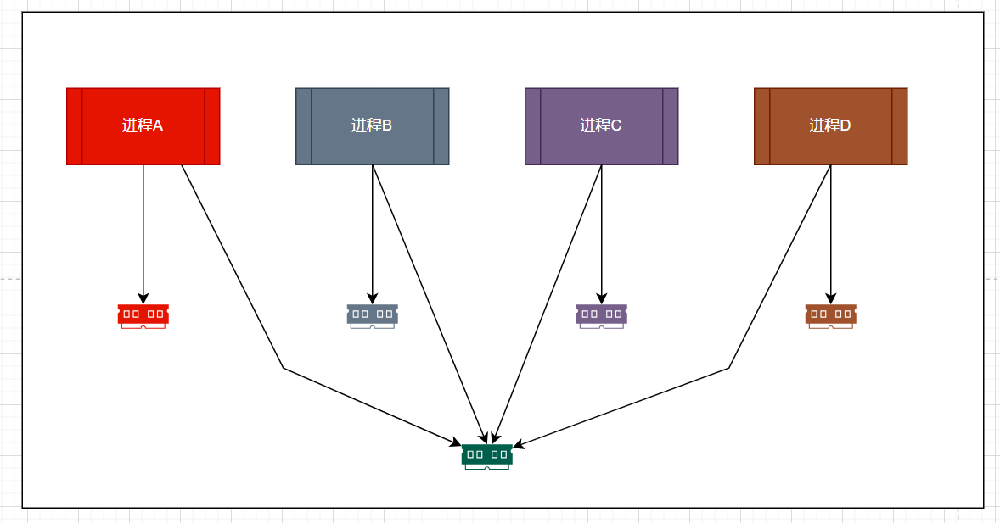

# 【Android IPC】 Android IPC概述

## 概述

IPC，英文全称为Inter-process communication，意思是进程间通信。这里包含了两个概念，进程和通信，我们先了解一下进程、通信和进程间通信三个概念。

> Wikipedia：
>
> 进程：进程（英语：process），是指计算机中已执行的程序，曾经是分时系统的基本运作单位。在面向进程设计的系统（如早期的UNIX，Linux 2.4及更早的版本）中，是程序的基本执行实体；在面向线程设计的系统（如当代多数操作系统、Linux 2.6及更新的版本）中，进程本身不是基本执行单位，而是线程的容器。
>
> 通信：通信是发送者通过某种媒体以某种格式来传递信息到收信者以达致某个目的。
>
> 进程间通信：进程间通信（Inter-Process Communication，简称IPC）是一种技术或方法，用于在至少两个进程或线程之间传输数据或信号。每个进程都有自己独立的系统资源，彼此隔离。为了实现不同进程之间的资源访问和协调工作，需要使用进程间通信。

计算机的资源本质上只有硬件部分，对上抽象为计算机资源，包括CPU、内存、存储、IO等；而计算机在处理计算机任务的时候，把这个任务抽象成“进程”的概念，“进程”拥有自己独立的资源等等，相互独立。而进程管理则是针对“进程”本身做资源分配、资源共享等等协调处理，保证进程可以正常运作。由此引出了资源同步、竞争、锁、进程间通信（进程和进程之间交换数据）等等概念。

而线程一般是归属于进程内部的，可以共享同一个进程下的资源。

为什么我们现在会有进程和线程的概念？以及我们如今的系统为什么会基于这两个概念进程计算机资源的管理呢？这个需要从计算机操作系统的发展里程讲起。

计算机操作系统OS从一开始的纸带打孔到如今的现代操作系统，经历了一系列的改善和进化。

一开始人们手动操作，觉得效率低下，便发明了批处理系统，将纸带保存到磁盘，然后让计算机批处理即可，这便是单通道批处理系统。但是单通道批处理系统也存在缺点，作业中某个时间段只会用到一部分计算机资源，但是需要等到整个作业完成，才可以进行下一个作业，这样就导致了其他资源的浪费。于是提出了多个通道的批处理系统，允许由系统调度作业进行处理，允许同时运行多个作业。

这个时候便有了所谓的“进程”的概念，使用进程来记录各个作业的数据、运行状态等等，针对进程进行调度管理。这里的进程，其实可以认为等同于一个作业；

但是多道批处理系统在处理任务的时候，进程本身的执行也是顺序执行的，但是有些时候任务是需要同时执行的。此外，由于进程相互独立，在进程创建、撤销、切换等任务操作时都存在较大的时间和空间的开销。以此提出了多线程的概念。

以上是IPC进程间通信一些相关的概念和由来，在讲进程由来的时候顺带提了一些线程的由来。这里挖个坑，后续在整理操作系统知识的时候，再重新整理OS的知识。因为这个章节主要学习Android下Binder IPC机制，一项新技术的出现，往往都是因为旧技术不能满足，我们接着讲一下Linux下常见的IPC机制和简单原理，了解下Android为什么要实现Binder机制。

## Linux 常见的IPC机制

### 管道

两个进程间，通过管道（一段缓存）进行数据传输，数据需要先从进程A拷贝到管道，进程B再从管道拷贝到进程B。

### 共享内存

多个进程共用同一块内存，不需要复制，但是控制复杂，且进程内的数据容易被其他进程访问，不安全。

### Socket套接字

作为更通用的接口，传输效率低，主要用于不通机器或跨网络的通信；

### IPC对比

共享内存效率高，但是控制复杂，且数据不安全；

管道效率低，数据安全，架构不合适；

Socket效率低，数据普遍安全，架构为C/S架构；

针对上面的情况，设计和实现了Binder机制。

|        | 管道         | 共享内存                             | Socket                                 | Binder                             |
| ------ | ------------ | ------------------------------------ | -------------------------------------- | ---------------------------------- |
| 性能   | 需要拷贝两次 | 无需拷贝                             | 需要拷贝两次以上                       | 需要拷贝一次                       |
| 特点   | 1：1         | 控制复杂，易用性差                   | 基于c/s 架构                           | 基于c/s 架构                       |
| 安全性 | 安全         | 依赖上层协议访问接入点是开放的不安全 | 依椅赖上层协议访问接入点是开放的不安全 | 为每个APP分配UID同时支持实名和匿名 |

## 参考

1. [Java并发编程之线程篇之线程的由来(一) | AndyJennifer'Blog](https://andyjennifer.com/2019/08/18/Java并发编程之线程篇-线程的由来/)

2. [多线程技术综述(一)：通用知识介绍 | 夏云的实验室 (yxylab.com)](https://www.yxylab.com/2022/03/07/multithreading/#h-2)

3. [进程 - 维基百科，自由的百科全书 (wikipedia.org)](https://zh.wikipedia.org/zh-cn/行程)

4. [进程间通信 - 维基百科，自由的百科全书 (wikipedia.org)](https://zh.wikipedia.org/wiki/行程間通訊)
5. [线程 - 维基百科，自由的百科全书 (wikipedia.org)](https://zh.wikipedia.org/wiki/线程)
6. [通信 - 维基百科，自由的百科全书 (wikipedia.org)](https://zh.wikipedia.org/wiki/通信)
7. 《Android开发艺术探索》
8. [【Linux学习】进程间通信的方式（匿名管道、命名管道、共享内存）1-阿里云开发者社区 (aliyun.com)](https://developer.aliyun.com/article/1383928)

