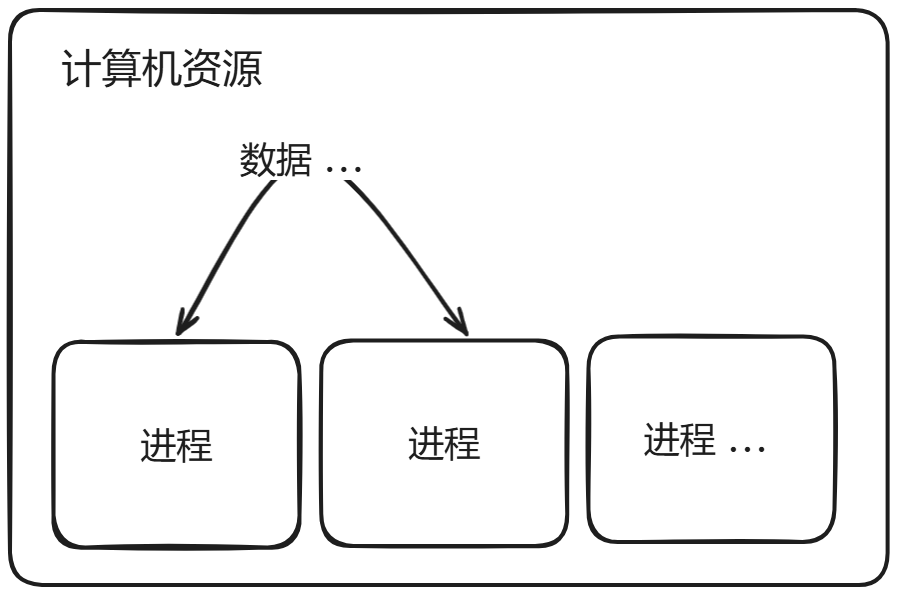
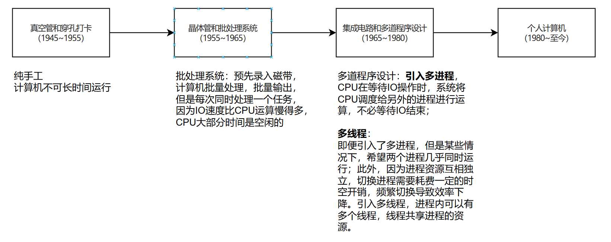
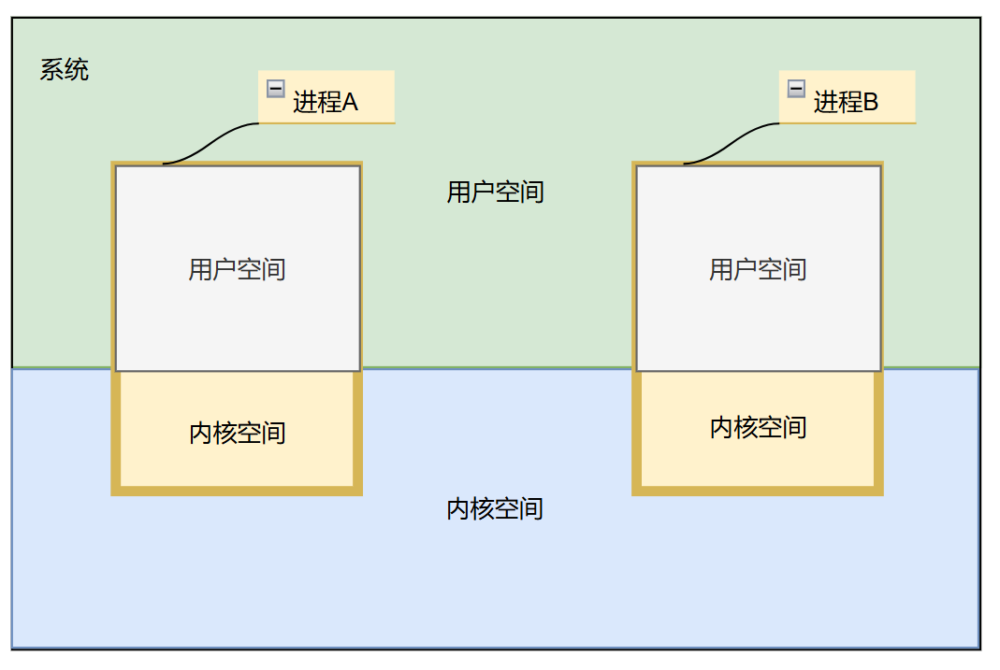
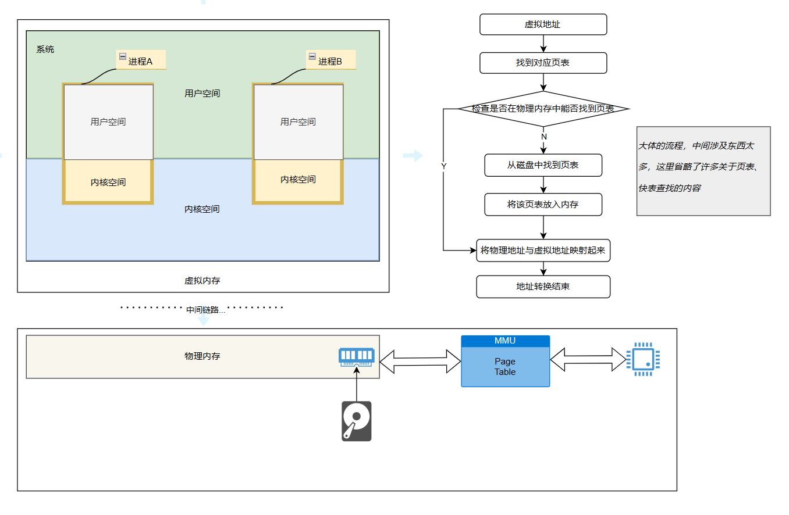

# 【Android IPC】Android Binder源码解析

> 此文章为课程学习笔记
>
> 结合[【手撕 FrameWork源码，从Binder → Handler → Zygote → AMS → PMS → WMS 彻底讲穿原理】https://www.bilibili.com/video/BV1uS4y1d7j2?p=4&vd_source=2bcce643839433e89df7fed8c5798b77](https://www.bilibili.com/video/BV1tA4y1f7cf/?spm_id_from=333.337.search-card.all.click&vd_source=acb61e4b6fa95ff36b3893f0e348be69)课程食用

## IPC概述

### IPC是什么？

IPC，英文全称为Inter-process communication，意思是进程间通信。这里包含了两个概念，进程和通信，我们先了解一下进程、通信和进程间通信三个概念。

> Wikipedia：
>
> 进程：进程（英语：process），是指计算机中已执行的程序，曾经是分时系统的基本运作单位。在面向进程设计的系统（如早期的UNIX，Linux 2.4及更早的版本）中，是程序的基本执行实体；在面向线程设计的系统（如当代多数操作系统、Linux 2.6及更新的版本）中，进程本身不是基本执行单位，而是线程的容器。
>
> 通信：通信是发送者通过某种媒体以某种格式来传递信息到收信者以达致某个目的。
>
> 进程间通信：进程间通信（Inter-Process Communication，简称IPC）是一种技术或方法，用于在至少两个进程或线程之间传输数据或信号。每个进程都有自己独立的系统资源，彼此隔离。为了实现不同进程之间的资源访问和协调工作，需要使用进程间通信。

计算机的资源本质上只有硬件部分，对上抽象为计算机资源，包括CPU、内存、存储、IO等；而计算机在处理计算机任务的时候，把这个任务抽象成“进程”的概念，“进程”拥有自己独立的资源等等，相互独立。而进程管理则是针对“进程”本身做资源分配、资源共享等等协调处理，保证进程可以正常运作。由此引出了资源同步、竞争、锁、进程间通信（进程和进程之间交换数据）等等概念。

而线程一般是归属于进程内部的，可以共享同一个进程下的资源。

## Binder的由来 ~ 为什么要设计Binder

> 一项新技术的出现，往往都是因为旧技术不能满足；
>
> Android系统是基于Linux系统建立的，我们接着讲一下Linux下常见的IPC机制和简单原理，了解下Android为什么要实设计Binder机制。

### Linux下常见的IPC机制

|        |       管道       |               共享内存               |                 Socket                 |
| :----: | :--------------: | :----------------------------------: | :------------------------------------: |
|  性能  |   需要拷贝两次   |               无需拷贝               |            需要拷贝两次以上            |
|  特点  | 1：1关系，不适用 |          控制复杂，易用性差          |              基于c/s 架构              |
| 安全性 |       安全       | 依赖上层协议访问接入点是开放的不安全 | 依椅赖上层协议访问接入点是开放的不安全 |

共享内存效率高，但是控制复杂，且数据不安全； 管道效率低，数据安全，架构不合适； Socket效率低，数据普遍安全，架构为C/S架构；

针对上面的情况，设计和实现了Binder机制， 最终Binder能够保证安全情况下，每次IPC通信仅拷贝一次数据提高效率和性能。

## Binder的基础知识 - 一堆的概念知识

> 因为学习Binder的时候，是跟着课程学习的，所以这里先讲原理，也会清晰一点。

Binder的原理其实很简单，**就是将双方进程内核空间下的虚拟地址，映射为同一片物理地址**，便可以实现一次拷贝实现IPC通信了。

> 以一个不大恰当的举例，那就是C或者C++的两个指针，指向同一片地址，因此只需要将数据复制一次即可了。

但是理解这句话，需要补充许多相关的前置知识，例如什么是内核空间、用户空间？什么是进程？什么是虚拟地址、物理地址？什么是MMU？等等。容我慢慢码字，娓娓道来。

### 操作系统的发展与进程的概念

> 既然讲进程，顺带也提一下线程吧。这两个不是指具体的实物，是属于一个概念词。为什么我们现在会有进程和线程的概念？以及我们如今的系统为什么会基于这两个概念计算机资源的管理呢？这个需要从计算机操作系统的发展里程讲起。

#### 操作系统的发展

> 计算机操作系统的发展史，不同的教材有不同的划分，此处以 《现代操作系统（原书第三版）》Andrew.S.Tanenbaum 为草靠。

计算机操作系统前后大致划分了4个阶段。

**真空管和穿孔打卡（1945~1955）：**

操作员以纯手工计算和命令计算机，计算机大部分时候处于空闲状态；

**晶体管和批处理系统（1955~1965）：**

发明批处理系统：预先录入磁带，计算机批量处理，逐一输出结果，但是每次计算机仅处理一个任务，因为IO速度比CPU运算慢得多，CPU大部分时间是空闲的；

**集成电路和多道程序设计（1965~1980）：**

**多进程：**

为了解决CPU资源浪费的问题，引入多进程，CPU在等待IO操作时，系统将CPU调度给另外的进程进行运算，不必等待IO结束；但是多进程存在一些不足。某些情况下，希望进程内某些任务并发运行；此外，由于进程资源互相独立，切换进程需要耗费一定的时空开销，频繁切换导致效率下降。

**多线程**：

为了解决多进程的不足，引入多线程。进程内可以有多个线程，线程共享进程的资源。进程内可以开启多个线程同时处理多个任务，也避免频繁切换进程导致不必要的时空开销。

> 题外话，因为资源共享等等的机制，虽然减少了开销，但是也带来了资源的同步、竞争等等关系...

### 进程的定义

**进程的定义是正在执行的程序的实例。进程通常又被称为task（任务）。**

程序是保存在存储中的可执行文件，可执行文件一般指的是CPU读得懂的二进制文件。

<u>**在程序启动之前，程序是一个被动的实体，而进程可以被认为是一个在行动的程序。进程是动态实体，因为它们在 CPU 执行机器代码指令时会不断变化。每个进程都包含 （1） 分配给它的*系统资源*、（2） 内存部分、（3） 安全属性（例如其*所有者*及其*权限*集）和 （4） 处理器*状态*。**</u>

处理器状态包括其寄存器和物理内存地址的内容。寄存器是内置于处理器中的非常小量的非常快的内存，以便通过提供对常用值的快速访问来加快其操作。内存地址是内存中的位置。

**进程的另一种定义是正在运行的程序的执行上下文，即 CPU 中当前时隙中的所有活动。**时隙，也称为时间片或量程，是允许每个进程在 CPU 中运行的时间长度，直到它被分时操作系统中的另一个进程抢占（即替换）为止。

这种复杂而强大的分时功能之所以成为可能，**是因为系统既能同时在内存中保留许多进程，又能足够快地在它们之间切换，使其看起来好像都在同时运行。**如果一个进程崩溃（即停止运行），它通常不会导致其他进程崩溃，因为每个进程都在自己受保护的内存空间（即内存区域）中运行，并且无法与其他进程交互，除非通过内核管理的安全机制（即操作系统的核心）。

**程序和进程是不同的实体。因此，在多任务操作系统中，单个程序的多个实例可以同时执行，并且每个实例都是独立的进程（或多个进程）。**例如，如果 7 个用户（每个用户都有自己的键盘和显示设备）决定同时运行 vi 文本编辑器，则将有 7 个单独的 vi 实例，每个实例都是单独的进程，尽管它们都将共享相同的可执行文件。单个用户同样可以同时运行 vi 的七个实例或其他一些程序。

对于那些熟悉C编程语言的人来说，**另一个兼容的进程定义（在C编程语言中编写了类Unix操作系统的内核和许多其他程序）是完全描述程序执行进展程度的数据结构的集合。数据结构是一种在计算机中存储数据以便可以有效使用数据的方法。**

幸运的是，普通用户无需完全理解这些定义即可理解进程的基本概念，并知道如何使用它们来控制他们的登录会话（即，在输入正确的用户名和密码后使用计算机）并使他们的工作更有效率。

> 上面仅为其中一部分，更多信息见链接中进程的定义。
>
> 1. [Process definition by The Linux Information Project (LINFO)](https://www.linfo.org/process.html)

### Linux用户空间和内核空间

Linux系统将系统**内存**分为两个不同的区域，内核空间和用户空间。**内核空间是Kernel运行并提供服务的区域；用户空间是内存中用户进程的运行部分。**

进程是程序执行的实例。用户进程是除内核以外的所有程序（即实用程序和应用程序）的实例。当一个程序要运行时，它被从存储器复制到用户空间，以便CPU（中央处理器）可以高速访问它。内核的作用之一是管理此空间内的各个用户进程，并防止它们相互干扰。

内核是构成计算机操作系统中心核心的程序。它不是一个进程，而是一个进程的控制器，它完全控制系统上发生的一切。这包括管理用户空间内的各个用户进程，并防止它们相互干扰。

用户进程只能通过使用系统调用来访问内核空间。系统调用是类 Unix 操作系统中由内核执行的服务的活动进程发出的请求，例如输入/输出 （I/O） 或进程创建。

> 注意：这里的用户空间和内核空间，指的是内存。

按照我的理解，进程、用户空间、内核空间的关系应该长这样。

+ 系统整个内存（这里指虚拟内存，后面会提到虚拟内存和物理内存）只会划分为用户空间和内核空间，当操作系统运行在用户空间，称为用户态，运行在内核空间，称为内核态；

+ 进程均分配了内核空间和用户空间，进程内部其实还划分了代码区、初始化数据段、未初始化数据段、堆、栈等等；
+ 重复上面的定义，内核的作用之一，就是管理各个用户进程，其实理解为就是**进程管理器**；
+ 而上面的IPC定义，这里同样可以理解为，如何利用内核，使两个独立的进程进行通信。

那么为什么Linux或者类Unix系统都遵循了这种设计方式，将系统划分为内核空间和用户空间呢？个人认为如下：

1. 多进程问题实现，如果没有内核空间这个进程控制器去管理进程，仅依赖各个进程自行使用资源，容易造成资源冲突等情况，例如进程A在内存#0处写入了A，进程B随后就在同一块地址篡改了数据等等；
2. 稳定性问题，如果没有内核空间，当某一个进程发生崩溃的时候，会连带整个系统崩溃，其他进程也不可用；
3. 安全性问题，内核对一些接口等信息做了抽象封装处理，对数据进行了隔离。

> 1. [Kernel Space Definition (linfo.org)](https://www.linfo.org/kernel_space.html)
> 2. [User Space Definition (linfo.org)](https://www.linfo.org/user_space.html)

### 虚拟地址、物理地址与MMU

虚拟地址和物理地址对应虚拟内存和物理内存上的地址，具体什么是物理内存和虚拟内存，我们再进一步看看。

物理内存：其实物理内存指的就是内存条提供的内存空间，物理内存只是相对于虚拟内存提出的概念。

虚拟内存：虚拟内存是计算机**内存管理的一种技术**。它的作用如下：

1. 使得应用程序认为它拥有连续可用的内存（一个连续完整的地址空间），而实际上物理内存通常被分隔成多个内存碎片，还有部分暂时存储在外部磁盘存储器上，在需要时进行数据交换，使用这种技术**使得大型程序的编写变得更容易，对真正的物理内存（例如RAM）的使用也更有效率**；
2. 虚拟内存技术可以使多个进程**共享同一个运行库**，并通过**分割不同进程的内存空间来提高系统的安全性**；
3. **利用硬盘驱动器 （HDD） 上的空间来模拟额外的主内存**；
   当物理内存全部被占用时，虚拟地址技术会将数据与硬盘交换，当需要的时候再从硬盘交换会内存，以此来扩充总系统内存；
   目前将数据在物理内存和硬盘中调度的方式有主要这三种：页式调度、段式调度、段页式调度；
   以页式调度为例，**每个页都与内存中的特定地址相关联**。当一个地址被引用时，该页就会被交换到内存中；
   这种虚拟内存管理，由一种称为内存管理单元MMU的电路来执行。

以上是综合维基百科等资料的描述。

1980s以前，内存的容量很小，各个程序都十分谨慎地使用内存（当然现在我们也应当这样），随着图形化趋势的增长，内存愈发显得宝贵。上面虚拟内存技术的第3个作用，似乎就是应对此而生的，而MMU正式实现这一作用的手段；

在1981年，摩托罗拉申请了一项专利，大大解决了此问题，此项专利就是MMU，Memory Management Unit 内存管理单元，[US4473878A - Memory management unit - Google Patents](https://patents.google.com/patent/US4473878A/en)；

> MMU：全称memory management unit 内存管理单元，它是一种负责处理中央处理器（CPU）的内存访问请求的计算机硬件。它的功能包括**虚拟地址到物理地址的转换（即虚拟内存管理）**、**内存保护**、**中央处理器高速缓存的控制**，在较为简单的计算机体系结构中，负责**总线的仲裁以及存储体切换**（bank switching，尤其是在8位的系统上）。

MMU是一个电路模块，置放在CPU和内存中间，主要负责的是虚拟内存地址和物理内存地址的映射。

## 源码一起读

[Android Binder图文详解和驱动源码分析_android binder源码解析-CSDN博客](https://blog.csdn.net/lylwo317/article/details/130230090)

## 面试题

## 参考

1. [Java并发编程之线程篇之线程的由来(一) | AndyJennifer'Blog](https://andyjennifer.com/2019/08/18/Java并发编程之线程篇-线程的由来/)

2. [多线程技术综述(一)：通用知识介绍 | 夏云的实验室 (yxylab.com)](https://www.yxylab.com/2022/03/07/multithreading/#h-2)

3. [进程 - 维基百科，自由的百科全书 (wikipedia.org)](https://zh.wikipedia.org/zh-cn/行程)

4. [进程间通信 - 维基百科，自由的百科全书 (wikipedia.org)](https://zh.wikipedia.org/wiki/行程間通訊)
5. [线程 - 维基百科，自由的百科全书 (wikipedia.org)](https://zh.wikipedia.org/wiki/线程)
6. [通信 - 维基百科，自由的百科全书 (wikipedia.org)](https://zh.wikipedia.org/wiki/通信)
7. 《Android开发艺术探索》
8. [【Linux学习】进程间通信的方式（匿名管道、命名管道、共享内存）1-阿里云开发者社区 (aliyun.com)](https://developer.aliyun.com/article/1383928)
9. [操作系统的历史记录 (osdata.com)](https://www.osdata.com/kind/history.htm)

## 基础知识

### Linux IPC机制

> 2. 

### 操作系统进程的概念

**进程的定义是正在执行的程序的实例。进程通常又被称为task（任务）。**

程序是保存在存储中的可执行文件，可执行文件一般指的是CPU读得懂的二进制文件。

<u>**在程序启动之前，程序是一个被动的实体，而进程可以被认为是一个在行动的程序。进程是动态实体，因为它们在 CPU 执行机器代码指令时会不断变化。每个进程都包含 （1） 分配给它的*系统资源*、（2） 内存部分、（3） 安全属性（例如其*所有者*及其*权限*集）和 （4） 处理器*状态*。**</u>

处理器状态包括其寄存器和物理内存地址的内容。寄存器是内置于处理器中的非常小量的非常快的内存，以便通过提供对常用值的快速访问来加快其操作。内存地址是内存中的位置。

**进程的另一种定义是正在运行的程序的执行上下文，即 CPU 中当前时隙中的所有活动。**时隙，也称为时间片或量程，是允许每个进程在 CPU 中运行的时间长度，直到它被分时操作系统中的另一个进程抢占（即替换）为止。

这种复杂而强大的分时功能之所以成为可能，**是因为系统既能同时在内存中保留许多进程，又能足够快地在它们之间切换，使其看起来好像都在同时运行。**如果一个进程崩溃（即停止运行），它通常不会导致其他进程崩溃，因为每个进程都在自己受保护的内存空间（即内存区域）中运行，并且无法与其他进程交互，除非通过内核管理的安全机制（即操作系统的核心）。

**程序和进程是不同的实体。因此，在多任务操作系统中，单个程序的多个实例可以同时执行，并且每个实例都是独立的进程（或多个进程）。**例如，如果 7 个用户（每个用户都有自己的键盘和显示设备）决定同时运行 vi 文本编辑器，则将有 7 个单独的 vi 实例，每个实例都是单独的进程，尽管它们都将共享相同的可执行文件。单个用户同样可以同时运行 vi 的七个实例或其他一些程序。

对于那些熟悉C编程语言的人来说，**另一个兼容的进程定义（在C编程语言中编写了类Unix操作系统的内核和许多其他程序）是完全描述程序执行进展程度的数据结构的集合。数据结构是一种在计算机中存储数据以便可以有效使用数据的方法。**

幸运的是，普通用户无需完全理解这些定义即可理解进程的基本概念，并知道如何使用它们来控制他们的登录会话（即，在输入正确的用户名和密码后使用计算机）并使他们的工作更有效率。

> 上面仅为其中一部分，更多信息见链接中进程的定义。
>
> 1. [Process definition by The Linux Information Project (LINFO)](https://www.linfo.org/process.html)

### 虚拟地址、物理地址、MMU概念

虚拟地址和物理地址对应虚拟内存和物理内存上的地址，具体什么是物理内存和虚拟内存，我们再进一步看看。

物理内存：其实物理内存指的就是内存条提供的内存空间，物理内存只是相对于虚拟内存提出的概念。

虚拟内存：虚拟内存是计算机**内存管理的一种技术**。它的作用如下：

1. 使得应用程序认为它拥有连续可用的内存（一个连续完整的地址空间），而实际上物理内存通常被分隔成多个内存碎片，还有部分暂时存储在外部磁盘存储器上，在需要时进行数据交换，使用这种技术**使得大型程序的编写变得更容易，对真正的物理内存（例如RAM）的使用也更有效率**；
2. 虚拟内存技术可以使多个进程**共享同一个运行库**，并通过**分割不同进程的内存空间来提高系统的安全性**；
3. **利用硬盘驱动器 （HDD） 上的空间来模拟额外的主内存**；
   当物理内存全部被占用时，虚拟地址技术会将数据与硬盘交换，当需要的时候再从硬盘交换会内存，以此来扩充总系统内存；
   目前将数据在物理内存和硬盘中调度的方式有主要这三种：页式调度、段式调度、段页式调度；
   以页式调度为例，**每个页都与内存中的特定地址相关联**。当一个地址被引用时，该页就会被交换到内存中；
   这种虚拟内存管理，由一种称为内存管理单元MMU的电路来执行。

MMU：全称memory management unit 内存管理单元，它是一种负责处理中央处理器（CPU）的内存访问请求的计算机硬件。它的功能包括**虚拟地址到物理地址的转换（即虚拟内存管理）**、**内存保护**、**中央处理器高速缓存的控制**，在较为简单的计算机体系结构中，负责**总线的仲裁以及存储体切换**（bank switching，尤其是在8位的系统上）。

## 面试题

### Q1 为什么Android要采用Binder做进程通信

（见Android IPC概述， 主要回答Linux常见的IPC机制和优缺点，最终针对什么情况才需要设计和实现Binder）

新技术的出现，一般都是因为旧技术无法满足现有需求才被发明出来的。Android系统是基于Linux系统上实现的。Linux系统常见的IPC机制有管道、共享内存、Socket等等。

管道是在系统内核空间建立一个管道，发送进程将数据写入管道，接收进程从管道读取数据，适用于1：1的关系，数据安全，但是每次通信需要复制2次，效率低；

共享内存是不同进程或多个进程共用一块内存，控制复杂，不需要重新拷贝，但是数据不安全；

Socket为C/S架构，通过端口转发机制实现，一般用于网络通信，拷贝效率较低；

基于这种情况，各种IPC机制均有不匹配的地方，因此设计Binder机制结合上面的优点进行通信。

### Q2 用户空间和内核空间区别

### Q3 简单说说物理地址和虚拟地址

### Q4 Binder如何做到一次拷贝

### Q5 简单讲讲mmap原理

### Q6 内存中的一页是什么，你怎么理解的

### Q7 Binder传输数据的大小限制是多少

### Q8 Binder并发支持多少线程

### Q9 Android APP有多少Binder线程，是固定的么

### Q10 bindservice启动Service与Binder服务实体的流程

### Q11 Java层Binder实体与与BinderProxy是如何实例化及使用的，与Native层的关系是怎样的

### Q12 Binder如何找到目标进程

为什么Android不采用Linux已有的进程通信，而是另辟蹊径弄一个binder(或者你认为binder是独有的吗)

Binder机制发生在哪个进程(或者 binder机制是发生在system_server进程，还是service_manager进程)。

Binder-次拷贝原理是什么(或者binder通信的效率为什么如此高效)

Binder传输数据的大小限制 传输Bitmap过大，就会崩溃的原因，Activity之间传输BitMap

为什么会有内核空间，和用户空间，设置内核空间的意义是什么

你了解mmap函数吗，说说他的机制是什么

什么是物理内存，什么是虚拟内存

Android APP进程天生支持Binder通信的原理是什么

Android APP有多少Binder线程，是因定的么

Binder线程的睡眠与唤醒(请求线程睡在哪个等待队列上，唤醒目标端哪个队列上的线程)

Binder协议中BC与BR的区别

Binder在传输数据的时候是如何层层封装的-不同层次使用的数据结构(命令的封装)

Binder驱动传递数据的释放(释放时机)

一个简单的Binder通信C/S模型
ServiceManager addService的限制(并非服务都能使用ServiceManager的addService)

bindService启动Service与Binder服务实体的流程

Java层Binder实体与与BinderProxy是如何实例化及使用的，与Native层的关系是怎样的

Parcel readStrongBinder与writeStrongBinder的原理

## 参考

1. [Kernel Space Definition (linfo.org)](https://www.linfo.org/kernel_space.html)
2. [[User Space Definition (linfo.org)](https://www.linfo.org/user_space.html)](https://www.linfo.org/user_space.html)
3. [Process definition by The Linux Information Project (LINFO)](https://www.linfo.org/process.html)