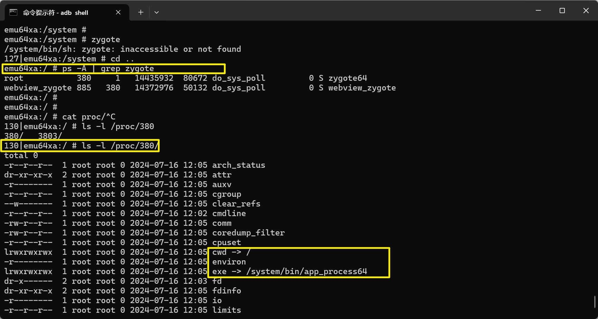

# 【Android开发技巧】如何通过进程找到所在目录？

在开发和排查系统问题的时候，进场会遇到需要找进程所在目录的时候，在此记录一篇笔记。

## 通过Linux命令查找

> 这种方法是普遍适用的，无论Android应用、原生命令等都可以查找。

1. `ps -A | grep <keyword> `查找进程号；
2. `ls -l /proc/$ {pid} `命令查看`exe`链接地址；
3. 链接地址即为进程所在目录；

> cwd符号链接的是进程运行目录；
>
> exe符号连接就是执行程序的绝对路径；
>
> cmdline就是程序运行时输入的命令行命令；
>
> environ记录了进程运行时的环境变量；

## 通过Android包名查找

> 此方法仅适用于查找Android包

1. 需要知道包名，如果不知道包名全程，可以先自行查找；
2. `pm path <pkg name>`，命令行会输出apk地址；

