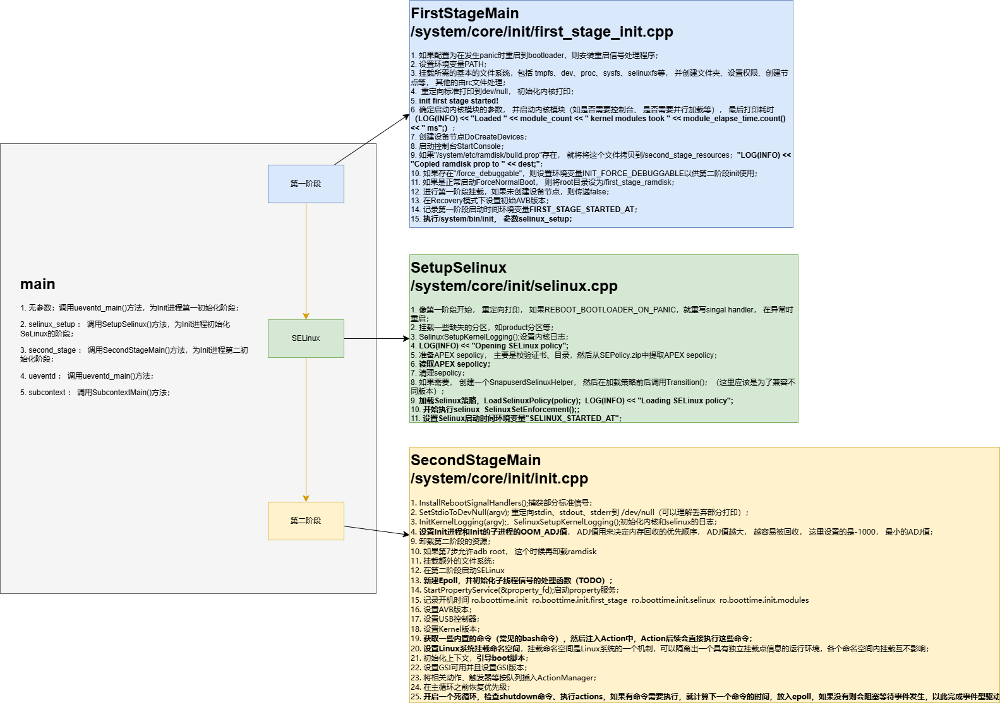

# 【Android系统启动】 Android Init 进程启动流程源码解析


## 前言

1. 文章源码按照AOSP官网源码[android14-release](https://cs.android.com/android/platform/superproject/+/android14-release:)Init进程代码进行解读；
2. 如有不当之处，麻烦指出作者进行修正


## 代码位置

> 1. system/core/init/main.cpp
> 2.  /system/core/rootdir/init.rc
> 3. /system/core/init/first_stage_init.cpp





## 源码解析

### main.cpp Init进程入口

```c++
int main(int argc, char** argv) {
#if __has_feature(address_sanitizer)
    __asan_set_error_report_callback(AsanReportCallback);
#elif __has_feature(hwaddress_sanitizer)
    __hwasan_set_error_report_callback(AsanReportCallback);
#endif
    // Boost prio which will be restored later
    setpriority(PRIO_PROCESS, 0, -20);
    if (!strcmp(basename(argv[0]), "ueventd")) {
        return ueventd_main(argc, argv);
    }

    if (argc > 1) {
        if (!strcmp(argv[1], "subcontext")) {
            android::base::InitLogging(argv, &android::base::KernelLogger);
            const BuiltinFunctionMap& function_map = GetBuiltinFunctionMap();

            return SubcontextMain(argc, argv, &function_map);
        }

        if (!strcmp(argv[1], "selinux_setup")) {
            return SetupSelinux(argv);
        }

        if (!strcmp(argv[1], "second_stage")) {
            return SecondStageMain(argc, argv);
        }
    }

    return FirstStageMain(argc, argv);
}
```

1. 可以从Init进程的main入口函数这里看到，Init进程进入后会将优先级设为最高，然后解析参数，根据参数有5种情况：
   1. **无参数：调用ueventd_main()方法，为Init进程第一初始化阶段；**
   2. **"selinux_setup" ： 调用SetupSelinux()方法，为Init进程初始化SeLinux的阶段；**
   3. **"second_stage" ： 调用SecondStageMain()方法，为Init进程第二初始化阶段；**
   4. "ueventd" ： 调用ueventd_main()方法，本篇文章不涉及；
   5. "subcontext" ： 调用SubcontextMain()方法，本篇文章不涉及；
2. 根据上一篇文章Kernel启动流程种可以看到， 当时调用是**没有带参数**的，因此这里从`FirstStageMain`开始；

```c++
// https://cs.android.com/android/kernel/superproject/+/common-android14-5.15:common/init/main.c
if (!try_to_run_init_process("/sbin/init") ||
	    !try_to_run_init_process("/etc/init") ||
	    !try_to_run_init_process("/bin/init") ||
	    !try_to_run_init_process("/bin/sh"))
		return 0;

static int try_to_run_init_process(const char *init_filename)
{
	int ret;

	ret = run_init_process(init_filename);

	if (ret && ret != -ENOENT) {
		pr_err("Starting init: %s exists but couldn't execute it (error %d)\n",
		       init_filename, ret);
	}

	return ret;
}
```


### first_stage_init.cpp 第一阶段Init

```cpp
int FirstStageMain(int argc, char** argv) {
    // 如果配置为在发生panic时重启到bootloader，则安装重启信号处理程序
    if (REBOOT_BOOTLOADER_ON_PANIC) {
        InstallRebootSignalHandlers();
    }

    // 记录启动时间
    boot_clock::time_point start_time = boot_clock::now();

    // 存储错误信息的容器
    std::vector<std::pair<std::string, int>> errors;
#define CHECKCALL(x) \
    if ((x) != 0) errors.emplace_back(#x " failed", errno);

    // 清除umask
    umask(0);

    // 清空环境变量
    CHECKCALL(clearenv());
    // 设置默认PATH
    CHECKCALL(setenv("PATH", _PATH_DEFPATH, 1));
    // 在initramdisk中进行基本的文件系统设置
    CHECKCALL(mount("tmpfs", "/dev", "tmpfs", MS_NOSUID, "mode=0755"));
    CHECKCALL(mkdir("/dev/pts", 0755));
    CHECKCALL(mkdir("/dev/socket", 0755));
    CHECKCALL(mkdir("/dev/dm-user", 0755));
    CHECKCALL(mount("devpts", "/dev/pts", "devpts", 0, NULL));
#define MAKE_STR(x) __STRING(x)
    CHECKCALL(mount("proc", "/proc", "proc", 0, "hidepid=2,gid=" MAKE_STR(AID_READPROC)));
#undef MAKE_STR
    // 不向非特权进程暴露原始命令行
    CHECKCALL(chmod("/proc/cmdline", 0440));
    std::string cmdline;
    android::base::ReadFileToString("/proc/cmdline", &cmdline);
    // 不向非特权进程暴露原始bootconfig
    chmod("/proc/bootconfig", 0440);
    std::string bootconfig;
    android::base::ReadFileToString("/proc/bootconfig", &bootconfig);
    gid_t groups[] = {AID_READPROC};
    // 设置进程组
    CHECKCALL(setgroups(arraysize(groups), groups));
    CHECKCALL(mount("sysfs", "/sys", "sysfs", 0, NULL));
    CHECKCALL(mount("selinuxfs", "/sys/fs/selinux", "selinuxfs", 0, NULL));

    // 创建/dev/kmsg设备节点
    CHECKCALL(mknod("/dev/kmsg", S_IFCHR | 0600, makedev(1, 11)));

    // 如果配置为允许任何人写入kmsg，则创建/dev/kmsg_debug设备节点
    if constexpr (WORLD_WRITABLE_KMSG) {
        CHECKCALL(mknod("/dev/kmsg_debug", S_IFCHR | 0622, makedev(1, 11)));
    }

    // 创建随机数设备节点
    CHECKCALL(mknod("/dev/random", S_IFCHR | 0666, makedev(1, 8)));
    CHECKCALL(mknod("/dev/urandom", S_IFCHR | 0666, makedev(1, 9)));

    // 创建设备节点
    CHECKCALL(mknod("/dev/ptmx", S_IFCHR | 0666, makedev(5, 2)));
    CHECKCALL(mknod("/dev/null", S_IFCHR | 0666, makedev(1, 3)));

    // 下面的挂载在第一阶段init中完成，以便第一阶段挂载可以挂载/mnt/{vendor,product}/的子目录。
    // 其他挂载，不需要第一阶段挂载，则应该在rc文件中完成。

    // 为由vold管理的设备挂载临时文件系统
    CHECKCALL(mount("tmpfs", "/mnt", "tmpfs", MS_NOEXEC | MS_NOSUID | MS_NODEV,
                    "mode=0755,uid=0,gid=1000"));
    // /mnt/vendor用于挂载特定于供应商的分区，这些分区不能作为供应商分区的一部分，例如，因为它们被以读写方式挂载。
    CHECKCALL(mkdir("/mnt/vendor", 0755));
    // /mnt/product用于挂载特定于产品的分区，这些分区不能作为产品分区的一部分，例如，因为它们被以读写方式挂载。
    CHECKCALL(mkdir("/mnt/product", 0755));

    // /debug_ramdisk用于保留调试ramdisk中的额外文件
    CHECKCALL(mount("tmpfs", "/debug_ramdisk", "tmpfs", MS_NOEXEC | MS_NOSUID | MS_NODEV,
                    "mode=0755,uid=0,gid=0"));

    // /second_stage_resources用于保留从第一阶段到第二阶段init的文件
    CHECKCALL(mount("tmpfs", kSecondStageRes, "tmpfs", MS_NOEXEC | MS_NOSUID | MS_NODEV,
                    "mode=0755,uid=0,gid=0"))
#undef CHECKCALL

    // 将标准输入/输出/错误重定向到/dev/null
    SetStdioToDevNull(argv);
    // 现在/dev上已经挂载了tmpfs，并且我们有了/dev/kmsg，我们实际上可以与外界通信了...
    InitKernelLogging(argv);

    // 如果存在错误，则记录并终止
    if (!errors.empty()) {
        for (const auto& [error_string, error_errno] : errors) {
            LOG(ERROR) << error_string << " " << strerror(error_errno);
        }
        LOG(FATAL) << "Init encountered errors starting first stage, aborting";
    }

    // 记录init第一阶段已启动
    LOG(INFO) << "init first stage started!";

    // 打开旧的根目录
    auto old_root_dir = std::unique_ptr<DIR, decltype(&closedir)>{opendir("/"), closedir};
    if (!old_root_dir) {
        PLOG(ERROR) << "Could not opendir(\"/\"), not freeing ramdisk";
    }

    struct stat old_root_info;
    // 获取旧的根目录信息
    if (stat("/", &old_root_info) != 0) {
        PLOG(ERROR) << "Could not stat(\"/\"), not freeing ramdisk";
        old_root_dir.reset();
    }

    // 确定是否需要在控制台上输出信息
    auto want_console = ALLOW_FIRST_STAGE_CONSOLE ? FirstStageConsole(cmdline, bootconfig) : 0;
    // 确定是否要并行加载模块
    auto want_parallel =
            bootconfig.find("androidboot.load_modules_parallel = \"true\"") != std::string::npos;

    // 加载内核模块
    boot_clock::time_point module_start_time = boot_clock::now();
    int module_count = 0;
    if (!LoadKernelModules(IsRecoveryMode() && !ForceNormalBoot(cmdline, bootconfig), want_console,
                           want_parallel, module_count)) {
        if (want_console != FirstStageConsoleParam::DISABLED) {
            LOG(ERROR) << "Failed to load kernel modules, starting console";
        } else {
            LOG(FATAL) << "Failed to load kernel modules";
        }
    }
    // 记录加载的模块数量和时间
    if (module_count > 0) {
        auto module_elapse_time = std::chrono::duration_cast<std::chrono::milliseconds>(
                boot_clock::now() - module_start_time);
        setenv(kEnvInitModuleDurationMs, std::to_string(module_elapse_time.count()).c_str(), 1);
        LOG(INFO) << "Loaded " << module_count << " kernel modules took "
                  << module_elapse_time.count() << " ms";
    }

    bool created_devices = false;
    // 如果在故障时要求在控制台上输出信息
    if (want_console == FirstStageConsoleParam::CONSOLE_ON_FAILURE) {
        if (!IsRecoveryMode()) {
            // 创建设备节点
            created_devices = DoCreateDevices();
            if (!created_devices) {
                LOG(ERROR) << "Failed to create device nodes early";
            }
        }
        // 启动控制台
        StartConsole(cmdline);
    }

    // 如果存在/bootimage_ramdisk.prop，则将其复制到第二阶段
    if (access(kBootImageRamdiskProp, F_OK) == 0) {
        std::string dest = GetRamdiskPropForSecondStage();
        std::string dir = android::base::Dirname(dest);
        std::error_code ec;
        if (!fs::create_directories(dir, ec) && !!ec) {
            LOG(FATAL) << "Can't mkdir " << dir << ": " << ec.message();
        }
        if (!fs::copy_file(kBootImageRamdiskProp, dest, ec)) {
            LOG(FATAL) << "Can't copy " << kBootImageRamdiskProp << " to " << dest << ": "
                       << ec.message();
        }
        LOG(INFO) << "Copied ramdisk prop to " << dest;
    }

    // 如果存在"/force_debuggable"，则设置环境变量INIT_FORCE_DEBUGGABLE以供第二阶段init使用
    if (access("/force_debuggable", F_OK) == 0) {
        constexpr const char adb_debug_prop_src[] = "/adb_debug.prop";
        constexpr const char userdebug_plat_sepolicy_cil_src[] = "/userdebug_plat_sepolicy.cil";
        std::error_code ec;  // 调用不会抛出异常的重载copy_file()
        if (access(adb_debug_prop_src, F_OK) == 0 &&
            !fs::copy_file(adb_debug_prop_src, kDebugRamdiskProp, ec)) {
            LOG(WARNING) << "Can't copy " << adb_debug_prop_src << " to " << kDebugRamdiskProp
                         << ": " << ec.message();
        }
        if (access(userdebug_plat_sepolicy_cil_src, F_OK) == 0 &&
            !fs::copy_file(userdebug_plat_sepolicy_cil_src, kDebugRamdiskSEPolicy, ec)) {
            LOG(WARNING) << "Can't copy " << userdebug_plat_sepolicy_cil_src << " to "
                         << kDebugRamdiskSEPolicy << ": " << ec.message();
        }
        // 设置环境变量INIT_FORCE_DEBUGGABLE
        setenv("INIT_FORCE_DEBUGGABLE", "true", 1);
    }

    // 如果是正常启动，则准备切换根文件系统
    if (ForceNormalBoot(cmdline, bootconfig)) {
        // 创建/first_stage_ramdisk目录
        mkdir("/first_stage_ramdisk", 0755);
        // 准备切换根文件系统
        PrepareSwitchRoot();
        // 必须使用挂载点作为目标调用SwitchRoot()，因此在此处将目标目录绑定到自身。
        if (mount("/first_stage_ramdisk", "/first_stage_ramdisk", nullptr, MS_BIND, nullptr) != 0) {
            PLOG(FATAL) << "Could not bind mount /first_stage_ramdisk to itself";
        }
        // 切换根文件系统
        SwitchRoot("/first_stage_ramdisk");
    }

    // 进行第一阶段挂载，如果未创建设备节点，则传递false
    if (!DoFirstStageMount(!created_devices)) {
        LOG(FATAL) << "Failed to mount required partitions early ...";
    }

    // 获取新的根目录信息
    struct stat new_root_info;
    if (stat("/", &new_root_info) != 0) {
        PLOG(ERROR) << "Could not stat(\"/\"), not freeing ramdisk";
        old_root_dir.reset();
    }

    // 如果旧的根目录存在且新的根目录设备号与旧的不同，则释放ramdisk
    if (old_root_dir && old_root_info.st_dev != new_root_info.st_dev) {
        FreeRamdisk(old_root_dir.get(), old_root_info.st_dev);
    }

    // 在恢复模式下设置初始AVB版本
    SetInitAvbVersionInRecovery();

    // 设置环境变量，记录第一阶段启动时间
    setenv(kEnvFirstStageStartedAt, std::to_string(start_time.time_since_epoch().count()).c_str(),
           1);

    // 设置selinux init的路径和参数
    const char* path = "/system/bin/init";
    const char* args[] = {path, "selinux_setup", nullptr};
    // 打开/dev/kmsg，重定向标准输出和标准错误到其上，并关闭文件描述符
    auto fd = open("/dev/kmsg", O_WRONLY | O_CLOEXEC);
    dup2(fd, STDOUT_FILENO);
    dup2(fd, STDERR_FILENO);
    close(fd);
    // 执行selinux init
    execv(path, const_cast<char**>(args));

    // 如果execv()返回，说明出现了错误，此时记录错误并终止
    PLOG(FATAL) << "execv(\"" << path << "\") failed";

    return 1;
}

```

上面代码的注释部分是原文翻译，部分是自己加上去。可以看到第一阶段做了如下工作：

1. InstallRebootSignalHandlers ： 实际上监听Linux的Signal，当收到这些Signal时，重启Bootloader，如果REBOOT_BOOTLOADER_ON_PANIC不为true，则不会处理；
2. 设置基本的环境， 如**设置环境变量、挂载基本的文件系统、挂载设备节点、初始化日志**等等，并监听是否出错，如果出错则停止；
3. 加载内核模块：根据配置**加载内核模块**，可以选择是否并行加载模块，并记录加载模块的数量和时间。
4. **创建设备节点和启动控制台**：根据配置决定是否在控制台上输出信息，如果配置为在故障时输出信息，则创建设备节点并启动控制台。
5. 复制 ramdisk 属性文件：如果存在 `/bootimage_ramdisk.prop` 文件，则将其复制到第二阶段用于使用。
6. 设置调试模式：如果存在 `/force_debuggable` 文件，则设置环境变量 `INIT_FORCE_DEBUGGABLE` 为 `true`，并复制相关属性文件到调试 ramdisk。
7. 准备切换根文件系统：如果是正常启动，创建 `/first_stage_ramdisk` 目录并准备切换根文件系统。
8. 进行第一阶段挂载：进行第一阶段的文件系统挂载。
9. 释放旧的 ramdisk：如果旧的根目录存在且新的根目录设备号与旧的不同，则释放 ramdisk。
10. 设置初始 AVB 版本：在恢复模式下设置初始 Android Verified Boot (AVB) 版本。
11. **设置环境变量：记录第一阶段启动时间**。
12. **执行 SELinux 初始化：设置 SELinux 初始化的路径和参数，并执行 SELinux 初始**化。

那么下一步去查看SeLinux的初始化吧。


### selinux.cpp SeLinux初始化

```c++
// SELinux设置过程围绕着snapuserd进行精心编排。策略必须从动态分区加载，在OTA期间，这些分区无法在没有snapuserd的情况下读取。
// 但是，随着以内核特权运行的snapuserd，加载策略将立即触发审核。
//
// 我们使用五个步骤来解决这个问题：
//  (1) 在snapuserd运行时将策略读入字符串中。
//  (2) 重写快照设备映射表，生成新的dm-user设备并刷新I/O。
//  (3) 终止snapuserd，因为它不再有任何dm-user设备可以附加。
//  (4) 加载sepolicy并在/dev中执行关键的restorecon，小心避免读取/system中的任何内容。
//  (5) 重新启动snapuserd并将其附加到步骤(2)中的dm-user设备上。
//
// 在此序列之后，可以安全地启用强制模式并继续引导。
int SetupSelinux(char** argv) {
    SetStdioToDevNull(argv); // 设置标准输入/输出/错误到/dev/null
    InitKernelLogging(argv); // 初始化内核日志记录

    if (REBOOT_BOOTLOADER_ON_PANIC) { // 如果在发生panic时重新引导引导加载程序
        InstallRebootSignalHandlers(); // 安装重新引导信号处理程序
    }

    boot_clock::time_point start_time = boot_clock::now(); // 记录启动时间点

    MountMissingSystemPartitions(); // 挂载缺失的系统分区

    SelinuxSetupKernelLogging(); // SELinux设置内核日志记录

    LOG(INFO) << "Opening SELinux policy"; // 记录打开SELinux策略

    PrepareApexSepolicy(); // 准备APEX sepolicy

    // 在潜在终止snapuserd之前读取策略
    std::string policy;
    ReadPolicy(&policy);
    CleanupApexSepolicy(); // 清理APEX sepolicy

    auto snapuserd_helper = SnapuserdSelinuxHelper::CreateIfNeeded(); // 创建snapuserd SELinux帮助器
    if (snapuserd_helper) {
        // 终止旧的snapuserd以避免审核消息。在此之后，我们不能从/system（或其他动态分区）读取，直到调用FinishTransition（）为止。
        snapuserd_helper->StartTransition(); // 开始转换
    }

    LoadSelinuxPolicy(policy); // 加载SELinux策略

    if (snapuserd_helper) {
        // 在启用强制之前，完成挂起的snapuserd转换。
        snapuserd_helper->FinishTransition(); // 完成转换
        snapuserd_helper = nullptr;
    }

    // 此restorecon在SelinuxSetEnforcement之前有意执行，因为在将SELinux设置为强制模式后，从tmpfs转换文件到*_contexts_file上下文所需的权限不应授予任何进程。
    if (selinux_android_restorecon("/dev/selinux/", SELINUX_ANDROID_RESTORECON_RECURSE) == -1) {
        PLOG(FATAL) << "restorecon failed of /dev/selinux failed"; // 恢复失败，终止
    }

    SelinuxSetEnforcement(); // 设置SELinux执行

    // 我们在内核域中，希望转换到init域。保存SELabel在其xattrs中的文件系统，例如ext4，此处不需要显式的restorecon，但其他文件系统需要。特别是对于A/B设备的恢复镜像等ramdisk。
    if (selinux_android_restorecon("/system/bin/init", 0) == -1) {
        PLOG(FATAL) << "restorecon failed of /system/bin/init failed"; // 恢复失败，终止
    }

    // 设置环境变量，记录SELinux启动时间
    setenv(kEnvSelinuxStartedAt, std::to_string(start_time.time_since_epoch().count()).c_str(), 1);

    const char* path = "/system/bin/init"; // 第二阶段init的路径
    const char* args[] = {path, "second_stage", nullptr}; // 第二阶段init的参数
    execv(path, const_cast<char**>(args)); // 执行第二阶段init

    // 如果execv()返回，则出现错误，记录并终止
    PLOG(FATAL) << "execv(\"" << path << "\") failed";

    return 1;
}
```

这里做的工作有：

1. **初始化日志**并设置标准输入/输出/错误到 `/dev/null`；
2. 如果配置为在发生 panic 时重启到 bootloader，则捕获信号并重启（跟上面第一阶段一样）；
3. 记录启动时间点；
4. **挂载**缺失的**系统分区**；
5. 设置内核日志记录和**打开 SELinux 策略**；
6. 准备 APEX sepolicy 并**读取策略，执行相关转换**；
7. **执行必要的恢复操作**，包括设置 SELinux 强制模式；
8. **执行第二阶段 init**。


### init.cpp - SecondStageMain 第二阶段Init

```c++
int SecondStageMain(int argc, char** argv) {
    if (REBOOT_BOOTLOADER_ON_PANIC) {
        InstallRebootSignalHandlers(); // 如果发生 panic，安装重新引导信号处理程序
    }

    // 等到 signalfd 注册之前，不应启动任何线程。
    // 如果确实需要这些线程，每个线程都应确保阻塞 SIGCHLD 信号。
    // 参见 b/223076262
    boot_clock::time_point start_time = boot_clock::now(); // 记录启动时间点

    trigger_shutdown = [](const std::string& command) { shutdown_state.TriggerShutdown(command); };

    SetStdioToDevNull(argv); // 设置标准输入/输出/错误到 /dev/null
    InitKernelLogging(argv); // 初始化内核日志记录
    LOG(INFO) << "init second stage started!"; // 记录第二阶段初始化开始

    SelinuxSetupKernelLogging(); // 设置 SELinux 内核日志记录

    // 更新 $PATH（如果第二阶段 init 新于第一阶段 init，则设置）
    if (setenv("PATH", _PATH_DEFPATH, 1) != 0) {
        PLOG(FATAL) << "Could not set $PATH to '" << _PATH_DEFPATH << "' in second stage"; // 设置 $PATH 失败，终止
    }

    // 初始化不应因为对其他进程的依赖而崩溃，因此我们忽略 SIGPIPE 并直接在调用点处理 EPIPE。
    // 请注意，将信号设置为 SIG_IGN 是继承的，但自定义信号处理程序不是。
    // 由于我们不希望为子进程忽略 SIGPIPE，因此为信号处理程序设置一个空操作函数。
    {
        struct sigaction action = {.sa_flags = SA_RESTART};
        action.sa_handler = [](int) {};
        sigaction(SIGPIPE, &action, nullptr);
    }

    // 设置 init 及其派生子进程的 oom_adj。
    if (auto result = WriteFile("/proc/1/oom_score_adj", StringPrintf("%d", DEFAULT_OOM_SCORE_ADJUST));
        !result.ok()) {
        LOG(ERROR) << "Unable to write " << DEFAULT_OOM_SCORE_ADJUST
                   << " to /proc/1/oom_score_adj: " << result.error(); // 写入 oom_adj 失败，记录错误
    }

    // 设置一个所有进程都可以访问的会话密钥环。
    // 它将保存诸如 FBE 加密密钥等内容。没有进程应该覆盖其会话密钥环。
    keyctl_get_keyring_ID(KEY_SPEC_SESSION_KEYRING, 1);

    // 表示引导正在进行中，以通知后台固件加载程序等。
    close(open("/dev/.booting", O_WRONLY | O_CREAT | O_CLOEXEC, 0000));

    // 查看是否需要加载调试属性以允许在设备解锁时 adb root。
    const char* force_debuggable_env = getenv("INIT_FORCE_DEBUGGABLE");
    bool load_debug_prop = false;
    if (force_debuggable_env && AvbHandle::IsDeviceUnlocked()) {
        load_debug_prop = "true"s == force_debuggable_env;
    }
    unsetenv("INIT_FORCE_DEBUGGABLE"); // 清除环境变量

    // 当不需要时，卸载调试 ramdisk，以防止属性服务从中读取 .prop 文件。
    if (!load_debug_prop) {
        UmountDebugRamdisk();
    }

    PropertyInit(); // 初始化属性服务

    // 在属性服务读取 .prop 文件后，卸载第二阶段资源。
    UmountSecondStageRes();

    // 当需要时，在属性服务读取 .prop 文件后卸载调试 ramdisk。
    if (load_debug_prop) {
        UmountDebugRamdisk();
    }

    // 挂载第二阶段 init 所需的额外文件系统。
    MountExtraFilesystems();

    // 现在为第二阶段设置 SELinux。
    SelabelInitialize(); // 初始化 SELinux 标签
    SelinuxRestoreContext(); // 恢复 SELinux 上下文

    Epoll epoll;
    if (auto result = epoll.Open(); !result.ok()) {
        PLOG(FATAL) << result.error(); // 打开 epoll 失败，终止
    }

    // 在响应其他待处理函数之前，我们总是先收集子进程。
    // 这是为了防止竞争，其他守护进程在服务退出后看到并要求 init 通过 ctl.start 启动它，而 init 尚未收集它。
    epoll.SetFirstCallback(ReapAnyOutstandingChildren);

    InstallSignalFdHandler(&epoll); // 安装信号描述符处理程序
    InstallInitNotifier(&epoll); // 安装初始化通知程序
    StartPropertyService(&property_fd); // 启动属性服务

    // 记录初始化阶段启动时间，以便 bootstat 记录。
    RecordStageBoottimes(start_time);

    // 设置 libavb 版本以进行框架限定的 OTA 匹配（在 Treble 构建中）。
    if (const char* avb_version = getenv("INIT_AVB_VERSION"); avb_version != nullptr) {
        SetProperty("ro.boot.avb_version", avb_version);
    }
    unsetenv("INIT_AVB_VERSION"); // 清除环境变量

    fs_mgr_vendor_overlay_mount_all(); // 挂载所有 vendor overlay
    export_oem_lock_status(); // 导出 OEM 锁定状态
    MountHandler mount_handler(&epoll); // 挂载处理器
    SetUsbController(); // 设置 USB 控制器
    SetKernelVersion(); // 设置内核版本

    const BuiltinFunctionMap& function_map = GetBuiltinFunctionMap(); // 获取内置函数映射
    Action::set_function_map(&function_map); // 设置动作函数映射

    if (!SetupMountNamespaces()) {
        PLOG(FATAL) << "SetupMountNamespaces failed"; // 设置 mount namespaces 失败，终止
    }

    InitializeSubcontext(); // 初始化子上下文

    ActionManager& am = ActionManager::GetInstance(); // 获取动作管理器实例
    ServiceList& sm = ServiceList::GetInstance(); // 获取服务列表实例

    LoadBootScripts(am, sm); // 加载引导脚本

    // 默认情况下，启用此项并允许 INFO 日志被丢弃，将会增加 0.2s 的 Nexus 9 启动时间，因此默认禁用。
    if (false) DumpState(); // 打印状态信息

    // 在脚本开始运行之前，使 GSI 状态可用。
    auto is_running = android::gsi::IsGsiRunning() ? "1" : "0";
    SetProperty(gsi::kGsiBootedProp, is_running); // 设置 GSI 启动属性
    auto is_installed = android::gsi::IsGsiInstalled() ? "1" : "0";
    SetProperty(gsi::kGsiInstalledProp, is_installed); // 设置 GSI 已安装属性
    if (android::gsi::IsGsiRunning()) {
        std::string dsu_slot;
        if (android::gsi::GetActiveDsu(&dsu_slot)) {
            SetProperty(gsi::kDsuSlotProp, dsu_slot); // 设置 DSU 槽位属性
        }
    }

    // 将内置动作排入队列以启动 cgroups 设置等。
    am.QueueBuiltinAction(SetupCgroupsAction, "SetupCgroups");
    am.QueueBuiltinAction(SetKptrRestrictAction, "SetKptrRestrict");
    am.QueueBuiltinAction(TestPerfEventSelinuxAction, "TestPerfEventSelinux");
    am.QueueBuiltinAction(ConnectEarlyStageSnapuserdAction, "ConnectEarlyStageSnapuserd");
    am.QueueEventTrigger("early-init");

    // 将一个动作排入队列，等待冷启动完成，以便我们知道 ueventd 已设置所有 /dev...
    am.QueueBuiltinAction(wait_for_coldboot_done_action, "wait_for_coldboot_done");
    // ...以便我们可以开始排队需要来自 /dev 的东西的动作。
    am.QueueBuiltinAction(SetMmapRndBitsAction, "SetMmapRndBits");
    Keychords keychords;
    am.QueueBuiltinAction(
            [&epoll, &keychords](const BuiltinArguments& args) -> Result<void> {
                for (const auto& svc : ServiceList::GetInstance()) {
                    keychords.Register(svc->keycodes());
                }
                keychords.Start(&epoll, HandleKeychord);
                return {};
            },
            "KeychordInit");

    // 触发所有引导动作以启动系统。
    am.QueueEventTrigger("init");

    // 在充电模式下不要挂载文件系统或启动核心系统服务。
    std::string bootmode = GetProperty("ro.bootmode", "");
    if (bootmode == "charger") {
        am.QueueEventTrigger("charger");
    } else {
        am.QueueEventTrigger("late-init");
    }

    // 基于属性当前状态运行所有属性触发器。
    am.QueueBuiltinAction(queue_property_triggers_action, "queue_property_triggers");

    // 在主循环之前恢复优先级。
    setpriority(PRIO_PROCESS, 0, 0);

    while (true) {
        // 默认情况下，睡眠直到发生事件。
        // 不要将 far_future 转换为 std::chrono::milliseconds，因为这会触发溢出。
        // boot_clock 的单位是 1ns。
        const boot_clock::time_point far_future = boot_clock::time_point::max();
        boot_clock::time_point next_action_time = far_future;

        auto shutdown_command = shutdown_state.CheckShutdown(); // 检查是否有关机命令
        if (shutdown_command) {
            LOG(INFO) << "Got shutdown_command '" << *shutdown_command
                      << "' Calling HandlePowerctlMessage()";
            HandlePowerctlMessage(*shutdown_command); // 处理关机消息
        }

        if (!(prop_waiter_state.MightBeWaiting() || Service::is_exec_service_running())) {
            am.ExecuteOneCommand(); // 执行一个命令
            // 如果还有更多工作要做，立即再次唤醒。
            if (am.HasMoreCommands()) {
                next_action_time = boot_clock::now();
            }
        }
        // 由于上面的代码检查了待处理的动作，因此在下面的 Epoll::Wait() 调用之前，不得有新的动作排队，
        // 而没有调用 WakeMainInitThread()。
        if (!IsShuttingDown()) {
            auto next_process_action_time = HandleProcessActions(); // 处理进程动作

            // 如果有需要重新启动的进程，请及时唤醒。
            if (next_process_action_time) {
                next_action_time = std::min(next_action_time, *next_process_action_time);
            }
        }

        std::optional<std::chrono::milliseconds> epoll_timeout;
        if (next_action_time != far_future) {
            epoll_timeout = std::chrono::ceil<std::chrono::milliseconds>(
                    std::max(next_action_time - boot_clock::now(), 0ns));
        }
        auto epoll_result = epoll.Wait(epoll_timeout); // 等待 epoll 事件
        if (!epoll_result.ok()) {
            LOG(ERROR) << epoll_result.error(); // 记录 epoll 错误
        }
        if (!IsShuttingDown()) {
            HandleControlMessages(); // 处理控制消息
            SetUsbController(); // 设置 USB 控制器
        }
    }

    return 0;
}

static void LoadBootScripts(ActionManager& action_manager, ServiceList& service_list) {
    Parser parser = CreateParser(action_manager, service_list);

    std::string bootscript = GetProperty("ro.boot.init_rc", "");
    if (bootscript.empty()) {
        parser.ParseConfig("/system/etc/init/hw/init.rc");
        if (!parser.ParseConfig("/system/etc/init")) {
            late_import_paths.emplace_back("/system/etc/init");
        }
        // late_import is available only in Q and earlier release. As we don't
        // have system_ext in those versions, skip late_import for system_ext.
        parser.ParseConfig("/system_ext/etc/init");
        if (!parser.ParseConfig("/vendor/etc/init")) {
            late_import_paths.emplace_back("/vendor/etc/init");
        }
        if (!parser.ParseConfig("/odm/etc/init")) {
            late_import_paths.emplace_back("/odm/etc/init");
        }
        if (!parser.ParseConfig("/product/etc/init")) {
            late_import_paths.emplace_back("/product/etc/init");
        }
    } else {
        parser.ParseConfig(bootscript);
    }
}
```

1. InstallRebootSignalHandlers();捕获部分标准信号；
2. SetStdioToDevNull(argv); 重定向stdin、stdout、stderr到 /dev/null（可以理解丢弃部分打印）；
3. InitKernelLogging(argv);、SelinuxSetupKernelLogging();初始化内核和selinux的日志；
4. 设置Init进程和Init的子进程的OOM_ADJ值， ADJ值用来决定内存回收的优先顺序， ADJ值越大， 越容易被回收， 这里设置的是-1000， 最小的ADJ值；
5. 卸载第二阶段的资源；
6. 如果第7步允许adb root， 这个时候再卸载ramdisk
7. 挂载额外的文件系统；
8. 在第二阶段启动SELinux
9. **新建Epoll，并初始化子线程信号的处理函数（TODO）；**
10. StartPropertyService(&property_fd);启动property服务；
11. **记录开机时间 ro.boottime.init  ro.boottime.init.first_stage  ro.boottime.init.selinux  ro.boottime.init.modules**
12. 设置AVB版本；
13. 设置USB控制器；
14. 设置Kernel版本；
19. **获取一些内置的命令（常见的bash命令），然后注入Action中，Action后续会直接执行这些命令；**
16. **设置Linux系统挂载命名空间，挂载命名空间是Linux系统的一个机制，可以隔离出一个具有独立挂载点信息的运行环境，各个命名空间内挂载互不影响；**
17. **初始化上下文，引导boot脚本；这里会从`/system/etc/init/hw/init.rc`、`/system/etc/init`等位置查找；**
18. 设置GSI可用并且设置GSI版本；
19. 将相关动作、触发器等按队列插入ActionManager；
20. 在主循环之前恢复优先级；
21. **开启一个死循环，检查shutdown命令、执行actions，如果有命令需要执行，就计算下一个命令的时间，放入epoll，如果没有则会阻塞等待事件发生，以此完成事件型驱动；**


### 启动zygote

init.rc文件中命令执行了start zygote

```rc
    start zygote
```


## Q&A

### Init进程启动分为几个阶段?每个阶段做了什么事情？

普遍认为2个阶段，但是从代码看也可以分为3个或者4个阶段。 第一阶段->selinux->第二阶段->uventd。第一个阶段，第一个阶段主要做了一些挂载基本文件系统、设置环境变量等的操作，第二阶段则挂在了额外的文件系统，使用epoll实现了一个事件驱动型的功能，加载和执行.rc文件中的命令；


### Init如何启动zygote？

在init.rc文件中， on zygote-start的地方， 写了start zygote， start是android内置的命令，在解析rc文件之前就已经将这些方法放到代码中了，命令会执行start方法，将zygote拉起来；


### Init如何解析.rc文件？

Init进程在第二阶段启动过程中，会调用LoadBootScripts方法，方法内部有Parser等工具类，将文件内容一一解析，然后会被放到actionmanager中执行。


PS：代码中epoll的使用和原理还不大懂，后续需要填坑...（哈哈，其实别的也很多不懂）


## 参考

1. https://cs.android.com/android/platform/superproject/+/android14-release:
1. [源码详解Android 9.0(P) 系统启动流程之init进程（第二阶段）_android 开机第二阶段-CSDN博客](https://blog.csdn.net/IT_xiao_bai0516/article/details/121160978?spm=1001.2014.3001.5502)