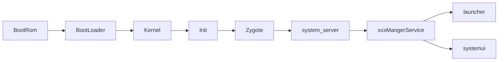

# 【Android系统启动】 1. Android启动流程概览

> 作为一个Android开发工程师，了解Android系统从上电到全功能启动的流程，是十分有必要的。这个对排查系统疑难问题、定制系统开发都十分有帮助。因此记录以下系列文章笔记。文章编写与2024年，基于AOSP官网主干代码ARM64b部分学习，按年份计算代码处于Android14~Android15中间。
>
> 笔者水平有限，如存在谬误，欢迎指出纠正

## Android启动主要流程概览

> 如图，机器上电到Android系统启动，依次为上图的流程，其中此系列暂时不深究各种系统核心服务，如ActivityManagerService、PackageManagerService，毕竟系统服务的数量有些多，会在另外的分类笔记中深究。另外此分类的文章，大部分仅注重Android的启动流程，对其他职责没有做过多深究。

### BootRom

从点击开关按钮，为机器设备开始上电起， 系统会运行BootRom中的代码。按照维基百科对BootRom的定义，Boot Rom分为两种， 一种是在启动后不能修改的掩膜ROM，另外一种就是可以包含UEFI实现的EEPROM（带电可擦可编程只读存储器）。

这里不会讲述从真正按下开关按钮的时候，从硬件上电到BootRom代码的过程，毕竟各种芯片电路等相关情况不一致。但是可以理解为BootRom就是存储在芯片ROM里面的高低电平数据，芯片上电后内部的设计会引导电路进入这一部分代码所在的电路，从而执行该代码的逻辑。如果在硬件和代码软件无法转弯过来的，可以参考这个知乎回答[代码是如何控制硬件的？ - 随风的回答 - 知乎 ](https://www.zhihu.com/question/20492284/answer/15279863)

> The **boot ROM** is a type of [ROM](https://en.wikipedia.org/wiki/ROM) that is used for [booting](https://en.wikipedia.org/wiki/Booting) a computer system.[[1\]](https://en.wikipedia.org/wiki/Boot_ROM#cite_note-1) There are two types: a [mask](https://en.wikipedia.org/wiki/Mask_rom) boot ROM that cannot be changed afterwards and a boot [EEPROM](https://en.wikipedia.org/wiki/EEPROM), which can contain an [UEFI](https://en.wikipedia.org/wiki/UEFI) implementation.
>
> Upon power up, hardware usually starts uninitialized. To continue booting, the system may need to read a [bootloader](https://en.wikipedia.org/wiki/Bootloader) from some peripheral device. It is often easier to implement routines for reading from external storage devices in software than in hardware. A boot ROM provides a place to store this initial loading code, at a fixed location immediately available to the processor when execution starts.
>
> > [Boot ROM - Wikipedia](https://en.wikipedia.org/wiki/Boot_ROM)

### BootLoader

BootRom启动后会启动BootLoader的代码，常见的BootLoader实现有U-Boot、RedBoot等等。它的作用是引导计算机操作系统启动，如果BootLoader提供一个可交互的菜单，调用不同的启动方式，也成为boot manager。高通芯片以及AOSP默认将little kernel作为bootloader的启动程序。

> [GitHub - littlekernel/lk: LK embedded kernel](https://github.com/littlekernel/lk)
>
> [Bootloader - Wikipedia](https://en.wikipedia.org/wiki/Bootloader)
>
> [lk - Android Code Search](https://cs.android.com/android/platform/superproject/main/+/main:external/trusty/lk/;l=1?q=lk&sq=)

### Kernel

AOSP默认使用Android Common Kernel作为Android系统的内核， Android Common Kernel（Android通用内核）是在Linux LTS发行版的Kernel基础上，与Android的补丁结合形成。具体的信息可以查看AOSP官网：[内核概览  | Android 开源项目  | Android Open Source Project](https://source.android.com/docs/core/architecture/kernel?hl=zh-cn)。里面详细描述了通用内核的架构、发版等各种信息。

### Init进程

Android可以认为是运行在Linux内核基础上的一个虚拟机， Kernel会检测并拉起Android的init进程，其进程号为1，是Android系统的第一个进程。 Init进程里面做了一系列初始化Android系统的工作，例如启动SeLinux，挂载分区、解析.rc文件并执行其动作、启动孵化器zygote等等。

### Zygote孵化器

Zygote，中文翻译为受精卵，相信在其他许多Android启动系列的博客已经提到过了。 Zygote负责启动system_server、虚拟机运行环境（Dalvik或者ART）、孵化其他应用进程等。

### system_server

system_server进程是Android核心进程，它负责启动各种系统核心服务，包括ActivityManagerService、PackageManagerService等等各种系统核心服务。一般system_server崩溃（进程号是否异常或者变化），我们可以认为Android系统重启了。

### Launcher启动

Launcher，翻译过来为发射器。一般我们在手机系统看到的第一个应用（即主页），便是Launcher应用。Launcher应用会显示一些常见 信息，因为一直会使用到，其重要性可见一斑（你能想象你的手机主页一直在崩溃吗？）

### SystemUI

SystemUI，顾名思义，系统UI页面， 一般包括状态栏、导航栏、下拉栏等等，这些页面的内容便是systemui的职责。

以上便是Android系统启动的各个阶段，后续文章将从BootLoader-Little Kernel的启动开始分析。 