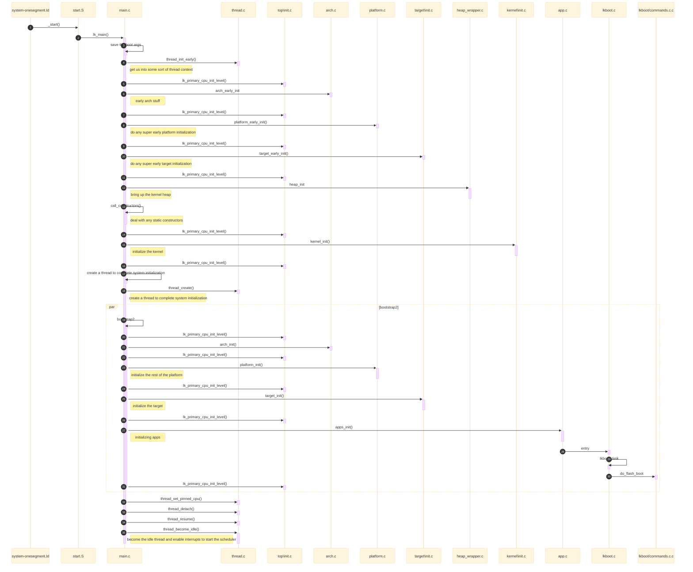
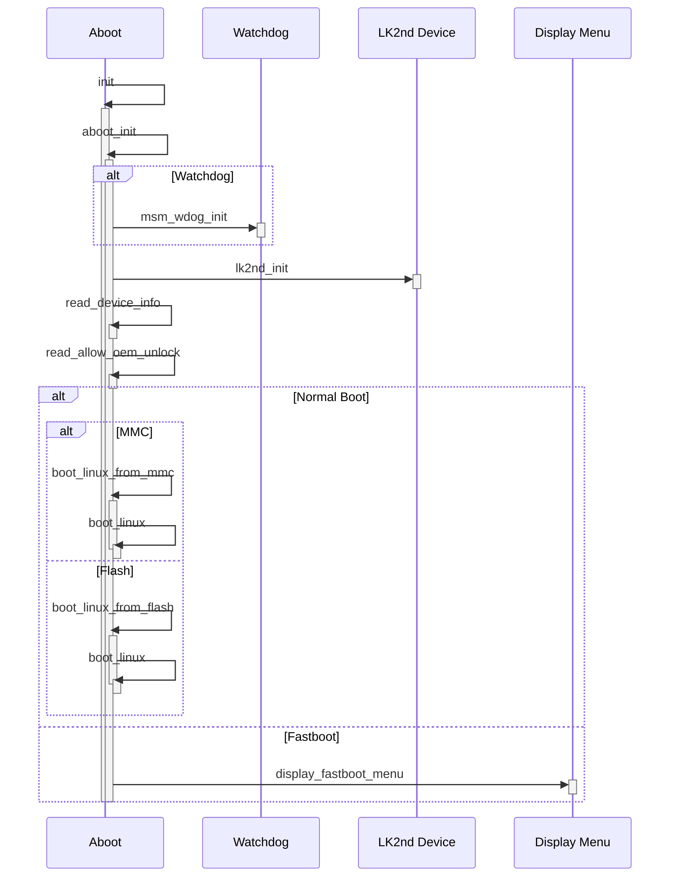
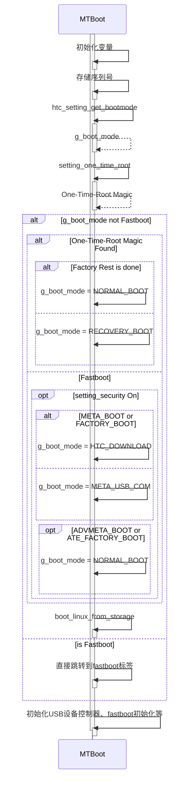

# 【Android系统启动】 BootLoader - Little Kernel启动流程源码解析


## 前言

+ 后文中的lk指 Little Kernel
+ Android启动会经过BootLoader阶段， BootLoader中， 挑选little kernel作为bootloader程序进行源码研究。 当然也许多公司使用的是uboot，像作者公司许多项目也是使用uboot。
+ lk官方源码中，没有集成高通、MTK平台的代码， 但是在github开源代码中，能够找到适配高通平台和MTK平台的lk，本文先是基于官方开源代码lk进行总体的分析， 然后对高通平台lk、MTK平台lk的不同部分进行分析；
+ 

## 代码结构与源码位置

1. lk开源代码位置：
   1. lk官方源码：[littlekernel/lk: LK embedded kernel (github.com)](https://github.com/littlekernel/lk)
   2. github上找到的参考的高通平台lk源码：[Aarqw12/lk_msm8953: little kernel (lk) bootloader for Qualcomm MSM8953 devices (github.com)](https://github.com/Aarqw12/lk_msm8953)
   3. github上找到的参考的MTK平台lk源码：[l33tnoob/lk_mtk: little kernel for mtk (github.com)](https://github.com/l33tnoob/lk_mtk)
2. 代码结构：

| 文件夹   | 说明                                                   |
| -------- | ------------------------------------------------------ |
| app      | app， lk应用相关代码                                   |
| arch     | archtechture，处理器架构相关代码                       |
| dev      | device， 设备相关代码                                  |
| docs     | document， lk相关文档                                  |
| external | external， 一些来自lk项目以外的源代码                  |
| kernel   | lk系统相关代码                                         |
| lib      | library， 相关库                                       |
| make     | make，mk文件，用于编译lk                               |
| platform | platform，平台驱动相关代码                             |
| projects | mk文件，与make文件夹不同的是，这里放的是不同的编译选项 |
| scripts  | scripts， 用于放置各种脚本                             |
| target   | target， 编译选项模板的相关驱动代码                    |
| tools    | tools， 相关工具代码，如python脚本等                   |
| top      | top， 之前好像是在根目录的，现在放到了这个目录下       |
|          |                                                        |


## LittleKernel启动时序图




## 源码分析

#### system-onesegment.ld

> arch\arm64\system-onesegment.ld

`system-onesegment.ld`是一个链接脚本，定义了C语言代码在编译器链接阶段，各种.o文件如何链接到一个输出文件的规则。其中`ENTRY(SYMBOL)` 标志是将符号SYMBOL的值设置成入口地址。

在lk启动之前， 设备上电后， 在BootRom阶段会将lk和kernel等镜像，从NVM（非易失性存储）中解压加载到内存，并执行里面的内容。加载后第一条指令，由`system-onesegment.ld`确定。

```c
OUTPUT_FORMAT("elf64-littleaarch64", "elf64-bigaarch64", "elf64-littleaarch64")
OUTPUT_ARCH(aarch64)
/* 这里定义了 _start 方法为入口的方法*/
ENTRY(_start)
```

从源码可以知道， 链接入口为_start_phys方法，并定义了_start_phys方法。 _start_phys方法会调用\_start， 而\_start()方法定义start.S文件中。

#### start.S

> arch\arm64\start.S

```S
.section .text.boot
FUNCTION(_start)  /** 这个是个宏定义 #define FUNCTION(x) .global x; .type x,STT_FUNC; x: **/
.globl arm_reset
arm_reset:
    /* keep track of the boot EL */
    mrs     boot_el, currentel

    /* if we came in at higher than EL1, drop down to EL1 */
    bl      arm64_elX_to_el1

    /* disable EL1 FPU traps */
    mov     tmp, #(0b11<<20)
    msr     cpacr_el1, tmp
...

#if KERNEL_SCS_ENABLED
    adrl    ssp, __shadow_stack
#endif

    bl  lk_main
    b   .
    
...
```

start.S是使用汇编语言编写的，_start方法做了一些初始化相关环境的操作，最后会调用到lk_main方法（bl是调用的标志），然后跳转到C的代码。


#### main.c - lk_main()

> external/trusty/lk/top/main.c

```C
/* called from arch code */
void lk_main(ulong arg0, ulong arg1, ulong arg2, ulong arg3) {
    // save the boot args
    lk_boot_args[0] = arg0;
    lk_boot_args[1] = arg1;
    lk_boot_args[2] = arg2;
    lk_boot_args[3] = arg3;

    // get us into some sort of thread context
    // 初始化多线程环境
    thread_init_early();

    // early arch stuff
    // 初始化CPU架构相关
    lk_primary_cpu_init_level(LK_INIT_LEVEL_EARLIEST, LK_INIT_LEVEL_ARCH_EARLY - 1);
    arch_early_init();

    // do any super early platform initialization
    // 初始化平台相关
    lk_primary_cpu_init_level(LK_INIT_LEVEL_ARCH_EARLY, LK_INIT_LEVEL_PLATFORM_EARLY - 1);
    platform_early_init();

    // do any super early target initialization
    // 初始化目标相关
    lk_primary_cpu_init_level(LK_INIT_LEVEL_PLATFORM_EARLY, LK_INIT_LEVEL_TARGET_EARLY - 1);
    target_early_init();

#if WITH_SMP
    dprintf(INFO, "\nwelcome to lk/MP\n\n");
#else
    dprintf(INFO, "\nwelcome to lk\n\n");
#endif
    dprintf(INFO, "boot args 0x%lx 0x%lx 0x%lx 0x%lx\n",
            lk_boot_args[0], lk_boot_args[1], lk_boot_args[2], lk_boot_args[3]);

    // bring up the kernel heap
    // 初始化kernel堆内存
    lk_primary_cpu_init_level(LK_INIT_LEVEL_TARGET_EARLY, LK_INIT_LEVEL_HEAP - 1);
    dprintf(SPEW, "initializing heap\n");
    heap_init();

    // deal with any static constructors
    // 调用静态构造方法
    dprintf(SPEW, "calling constructors\n");
    call_constructors();

    // initialize the kernel
    // 初始化内核
    lk_primary_cpu_init_level(LK_INIT_LEVEL_HEAP, LK_INIT_LEVEL_KERNEL - 1);
    kernel_init();

    lk_primary_cpu_init_level(LK_INIT_LEVEL_KERNEL, LK_INIT_LEVEL_THREADING - 1);

    // create a thread to complete system initialization
    // 开启一个bootstrap2线程，运行其他初始化， 然后与主线程分离、唤醒；
    // 这里叫bootstrap2， 可以认为初始化分为2个阶段，一个阶段是early的阶段，且bootstrap线程在thread_init_early方法内部就已经创建了
    dprintf(SPEW, "creating bootstrap completion thread\n");
    thread_t *t = thread_create("bootstrap2", &bootstrap2, NULL, DEFAULT_PRIORITY, DEFAULT_STACK_SIZE);
    thread_set_pinned_cpu(t, 0);
    thread_detach(t);
    thread_resume(t);

    // become the idle thread and enable interrupts to start the scheduler
    // 主线程变成idle线程
    thread_become_idle();
}
```

重点是这里的lk_main方法，这里主要做了以下工作：

> 这里可以看到了多次调用lk_primary_cpu_init_level方法，lk_primary_cpu_init_level方法最终会开启一个死循环，然后按照优先级进行初始化的工作；

1. 初始化线程环境，为后面多线程创造条件；
2. 初始化各个架构、平台、目标；
3. 初始化内核的堆内存，为系统运行时的内存管理做准备；
4. 调用静态构造函数，执行一些全局对象的构造工作；
5. 初始化内核，包括对内核的各个子系统进行初始化操作；
6. 继续初始化线程系统，为系统的多线程操作做进一步的准备；
7. **创建一个bootstrap2线程来完成系统的初始化工作**；
8. 成为IDLE线程。 Idle线程是每个CPU的0号线程， 这个线程在thread_init_early方法的内部创建， 一般而言idle线程上没有用户或者内核任务执行，当CPU运行在idle线程上，证明此时CPU进入空闲状态。


### main.c - bootstrap2()

```c
static int bootstrap2(void *arg) {
    dprintf(SPEW, "top of bootstrap2()\n");

    // 初始化架构相关
    lk_primary_cpu_init_level(LK_INIT_LEVEL_THREADING, LK_INIT_LEVEL_ARCH - 1);
    arch_init();

    // initialize the rest of the platform
    // 初始化平台相关
    dprintf(SPEW, "initializing platform\n");
    lk_primary_cpu_init_level(LK_INIT_LEVEL_ARCH, LK_INIT_LEVEL_PLATFORM - 1);
    platform_init();

    // initialize the target
    // 初始化目标相关
    dprintf(SPEW, "initializing target\n");
    lk_primary_cpu_init_level(LK_INIT_LEVEL_PLATFORM, LK_INIT_LEVEL_TARGET - 1);
    target_init();

    dprintf(SPEW, "initializing apps\n");
    // 初始化各个应用
    lk_primary_cpu_init_level(LK_INIT_LEVEL_TARGET, LK_INIT_LEVEL_APPS - 1);
    apps_init();

    lk_primary_cpu_init_level(LK_INIT_LEVEL_APPS, LK_INIT_LEVEL_LAST);

    return 0;
}
```

这里主要做的内容：

1. 初始化架构、平台、目标相关的操作；
2. 初始化各个应用；
3. 为每个初始化确定了初始化的优先级；


### app.c - apps_init

> app\app.c

```c
void apps_init(void) {
    const struct app_descriptor *app;

    /* call all the init routines */
    // 遍历 app 数组（指针）， 然后调用各个appp的init方法； 
    for (app = &__start_apps; app != &__stop_apps; app++) {
        if (app->init)
            app->init(app);
    }

    /* start any that want to start on boot */
    // 遍历 app 数组（指针）， 如果app的entry函数存在，并且app的FLAG传入start_app方法，并且都要求与进程分离
    for (app = &__start_apps; app != &__stop_apps; app++) {
        if (app->entry && (app->flags & APP_FLAG_NO_AUTOSTART) == 0) {
            start_app(app, true);
        }
    }
}


static int app_thread_entry(void *arg) {
    const struct app_descriptor *app = (const struct app_descriptor *)arg;

    app->entry(app, NULL);

    return 0;
}

static void start_app(const struct app_descriptor *app, bool detach) {
    /* dont start an app that has no entry point */
    // 传入的App先判断entry函数是否存在，如果不存在直接返回
    if (app->entry == NULL) {
        return;
    }

    // 确定栈的大小
    uint32_t stack_size = (app->flags & APP_FLAG_CUSTOM_STACK_SIZE) ? app->stack_size : DEFAULT_STACK_SIZE;

    printf("starting app %s\n", app->name);
    // 多线程创建各个App， 每个App的entry函数， 均是一个独立的线程， （因为上面传下来的detach都为true）， 各个App的线程均与进程分离， 这里的app_thread_entry方法实际上就是调用app->entry(app, NULL);
    thread_t *t = thread_create(app->name, &app_thread_entry, (void *)app, DEFAULT_PRIORITY, stack_size);
    if (detach) {
        thread_detach(t);
        thread_resume(t);
    } else {
        thread_resume(t);
        thread_join(t, NULL, INFINITE_TIME);
    }
}
```

这里做的工作：

1. 在当前线程， 遍历app数组， 调用init方法；
2. 遍历app数组， 判断entry方法是否存在且flag不等于0（我也不知道这个flag有什么用）， 就从传入start_app方法；
3. start_app方法为每个app单独创建一个线程， 调用app的entry方法；

问题是，这个app是从哪里来的呢？

app的结构是app_descriptor，先查看这个app_descriptor的定义，在app\include\app.h， 在同一个文件中搜索，即可看到在宏定义中引用了。`__SECTION("apps")` 宏的作用是指示编译器将变量或函数放置到名为 "apps" 的代码段中，可以理解为只要在编译的时候使用了这个宏，编译器就会把app存到这个apps中，相当于在编译的时候注册了。

```c
/* each app needs to define one of these to define its startup conditions */
struct app_descriptor {
    const char *name;
    app_init  init;
    app_entry entry;
    unsigned int flags;
    size_t stack_size;
};

#define APP_START(appname) const struct app_descriptor _app_##appname __USED __ALIGNED(sizeof(void *)) __SECTION("apps") = { .name = #appname,

#define APP_END };
```

然后我们只需要搜索APP_START，就可以知道有哪些app了。

使用APP_START宏定义的，基本都在app文件夹下面，里面包括shell、loader等相关app。


###  lkboot.c - lkboot_task

```c

static void lkboot_task(const struct app_descriptor *app, void *args) {
    /* read a few sysparams to decide if we're going to autoboot */
    uint8_t autoboot = 1;
    sysparam_read("lkboot.autoboot", &autoboot, sizeof(autoboot));

    /* let platform code have a shot at disabling the autoboot behavior */
    if (platform_abort_autoboot())
        autoboot = 0;

#if !LKBOOT_AUTOBOOT
    autoboot = 0;
#endif

    /* if we're going to autoobot, read the timeout value */
    lk_time_t autoboot_timeout;
    if (!autoboot) {
        autoboot_timeout = INFINITE_TIME;
    } else {
        autoboot_timeout = LKBOOT_AUTOBOOT_TIMEOUT;
        sysparam_read("lkboot.autoboot_timeout", &autoboot_timeout, sizeof(autoboot_timeout));
    }

    TRACEF("autoboot %u autoboot_timeout %u\n", autoboot, (uint)autoboot_timeout);

#if LKBOOT_WITH_SERVER
    lkboot_server(autoboot_timeout);
#else
    if (autoboot_timeout != INFINITE_TIME) {
        TRACEF("waiting for %u milliseconds before autobooting\n", (uint)autoboot_timeout);
        thread_sleep(autoboot_timeout);
    }
#endif

    if (autoboot_timeout != INFINITE_TIME) {
        TRACEF("trying to boot from flash...\n");
        status_t err = do_flash_boot();
        TRACEF("do_flash_boot returns %d\n", err);
    }

#if LKBOOT_WITH_SERVER
    TRACEF("restarting server\n");
    lkboot_server(INFINITE_TIME);
#endif

    TRACEF("nothing to do, exiting\n");
}

APP_START(lkboot)
.entry = lkboot_task,
.flags = 0,
APP_END
```

官方源码中，是通过lkboot启动的，可以看到这里entry方法为lkboot_task， lk_boot方法会调用到**do_flash_boot()**从flash中启动系统；


### commands.c - do_flash_boot

```c
/* try to boot the system from a flash partition */
status_t do_flash_boot(void) {
    status_t err;

    LTRACE_ENTRY;

    /* construct a boot argument list */
    const size_t bootargs_size = PAGE_SIZE;
#if 0
    /* old code */
    void *args = (void *)((uintptr_t)lkb_iobuffer + lkb_iobuffer_size - bootargs_size);
    paddr_t args_phys = lkb_iobuffer_phys + lkb_iobuffer_size - bootargs_size;
#elif PLATFORM_ZYNQ
    /* grab the top page of sram */
    paddr_t args_phys = SRAM_BASE + SRAM_SIZE - bootargs_size;
    void *args = paddr_to_kvaddr(args_phys);
#else
#error need better way
#endif
    LTRACEF("boot args %p, phys 0x%lx, len %zu\n", args, args_phys, bootargs_size);

    bootargs_start(args, bootargs_size); // 初始化引导参数列表
    bootargs_add_command_line(args, bootargs_size, "what what"); // 添加引导命令行
    arch_clean_cache_range((vaddr_t)args, bootargs_size); // 清除缓存

    ulong lk_args[4]; // LK 参数数组
    bootargs_generate_lk_arg_values(args_phys, lk_args); // 生成 LK 参数值

    const void *ptr;

    if (!ptable_found_valid()) { // 检查分区表是否有效
        TRACEF("ptable not found\n");
        return ERR_NOT_FOUND;
    }

    /* find the system partition */
    struct ptable_entry entry;
    err = ptable_find("system", &entry); // 查找系统分区
    if (err < 0) {
        TRACEF("cannot find system partition\n");
        return ERR_NOT_FOUND;
    }

    /* get a direct pointer to the device */
    bdev_t *bdev = ptable_get_device(); // 获取设备指针
    if (!bdev) {
        TRACEF("error opening boot device\n");
        return ERR_NOT_FOUND;
    }

    /* convert the bdev to a memory pointer */
    err = bio_ioctl(bdev, BIO_IOCTL_GET_MEM_MAP, (void *)&ptr); // 将 bdev 转换为内存指针
    TRACEF("err %d, ptr %p\n", err, ptr);
    if (err < 0) {
        TRACEF("error getting direct pointer to block device\n");
        return ERR_NOT_FOUND;
    }

    /* sniff it to see if it's a bootimage or a raw image */
    bootimage_t *bi;
    if (bootimage_open((char *)ptr + entry.offset, entry.length, &bi) >= 0) { // 检查引导镜像类型
        size_t len;

        /* it's a bootimage */
        TRACEF("detected bootimage\n");

        /* find the lk image */
        if (bootimage_get_file_section(bi, TYPE_LK, &ptr, &len) >= 0) { // 查找 LK 镜像
            TRACEF("found lk section at %p\n", ptr);

            /* add the boot image to the argument list */
            size_t bootimage_size;
            bootimage_get_range(bi, NULL, &bootimage_size);

            bootargs_add_bootimage_pointer(args, bootargs_size, bdev->name, entry.offset, bootimage_size); // 添加引导镜像信息到引导参数列表
        }
    } else {
        /* did not find a bootimage, abort */
        bio_ioctl(bdev, BIO_IOCTL_PUT_MEM_MAP, NULL);
        return ERR_NOT_FOUND;
    }

    TRACEF("chain loading binary at %p\n", ptr);
    arch_chain_load((void *)ptr, lk_args[0], lk_args[1], lk_args[2], lk_args[3]); // 链式加载

    /* put the block device back into block mode (though we never get here) */
    bio_ioctl(bdev, BIO_IOCTL_PUT_MEM_MAP, NULL);

    return NO_ERROR;
}
```

1. 构建并初始化引导的参数并生成lk的参数；
2. 检查分区表是否游戏奥，然后找到system分区；
3. 获取设备的指针，再通过设备的指针找到内存的指针；
4. **检查和查找lk类型的镜像；**
5. **根据lk的参数进行链式加载；**
6. 释放资源；


## 高通平台的 aboot.c

> 高通平台的lk， 采用github上开源项目Aarqw12/lk_msm8953: little kernel (lk) bootloader for Qualcomm MSM8953 devices (github.com)](https://github.com/Aarqw12/lk_msm8953)，前面的启动流程基本一致，在lk的app中，使用了高通的aboot，下面大概过一下高通的aboot启动的流程

### 时序图




### aboot.c - APP_START

```c
APP_START(aboot)
	.init = aboot_init, // aboot 初始化函数
APP_END
```

按照上面apps_init的流程，我们先找到aboot的init方法是aboot_init， 那我们就继续看aboot_init方法的源码；


### aboot.c - aboot_init

```c
void aboot_init(const struct app_descriptor *app)
{
	unsigned reboot_mode = 0; // 声明重启模式
	int boot_err_type = 0; // 声明引导错误类型
	int boot_slot = INVALID; // 声明引导槽位，默认为无效值

	/* Initialise wdog to catch early lk crashes */
#if WDOG_SUPPORT
	msm_wdog_init(); // 初始化看门狗
#endif

	/* Setup page size information for nv storage */
	if (target_is_emmc_boot()) // 检查是否从 eMMC 启动
	{
		page_size = mmc_page_size(); // 设置页面大小
		page_mask = page_size - 1; // 页面掩码
		mmc_blocksize = mmc_get_device_blocksize(); // 获取 eMMC 设备块大小
		mmc_blocksize_mask = mmc_blocksize - 1; // eMMC 块大小掩码
	}
	else
	{
		page_size = flash_page_size(); // 设置页面大小
		page_mask = page_size - 1; // 页面掩码
	}
	ASSERT((MEMBASE + MEMSIZE) > MEMBASE); // 断言

	lk2nd_init(); // 初始化 lk 
	read_device_info(&device); // 读取设备信息
	read_allow_oem_unlock(&device); // 读取是否允许 OEM 解锁

	/* Detect multi-slot support */
	if (partition_multislot_is_supported()) // 检测是否支持多槽位
	{
		boot_slot = partition_find_active_slot(); // 查找活动槽位
		if (boot_slot == INVALID) // 如果槽位无效
		{
			boot_into_fastboot = true; // 引导进入 fastboot 模式
			dprintf(INFO, "Active Slot: (INVALID)\n"); // 打印活动槽位无效信息
		}
		else
		{
			/* Setting the state of system to boot active slot */
			partition_mark_active_slot(boot_slot); // 设置系统状态为引导活动槽位
			dprintf(INFO, "Active Slot: (%s)\n", SUFFIX_SLOT(boot_slot)); // 打印活动槽位信息
		}
	}

	/* Display splash screen if enabled */
#if DISPLAY_SPLASH_SCREEN
#if NO_ALARM_DISPLAY
	if (!check_alarm_boot()) { // 检查是否启用alarm_boot()
#endif
		dprintf(SPEW, "Display Init: Start\n"); // 显示初始化开始
#if DISPLAY_HDMI_PRIMARY
	if (!strlen(device.display_panel))
		strlcpy(device.display_panel, DISPLAY_PANEL_HDMI,
			sizeof(device.display_panel));
#endif
#if ENABLE_WBC
		/* Wait if the display shutdown is in progress */
		while(pm_app_display_shutdown_in_prgs()); // 等待显示关闭完成
		if (!pm_appsbl_display_init_done())
			target_display_init(device.display_panel); // 初始化显示
		else
			display_image_on_screen(); // 在屏幕上显示图像
#else
		target_display_init(device.display_panel); // 初始化显示
#endif
		dprintf(SPEW, "Display Init: Done\n"); // 显示初始化完成
#if NO_ALARM_DISPLAY
	}
#endif
#endif

	target_serialno((unsigned char *) sn_buf); // 获取序列号
	dprintf(SPEW,"serial number: %s\n",sn_buf); // 打印序列号

	memset(display_panel_buf, '\0', MAX_PANEL_BUF_SIZE); // 清空显示面板缓冲区

	/* Check if we should do something other than booting up */
	if (keys_get_state(KEY_VOLUMEUP) && keys_get_state(KEY_VOLUMEDOWN)) // 如果音量上下键同时按下
	{
		dprintf(ALWAYS,"dload mode key sequence detected\n"); // 检测到下载模式键序列
		reboot_device(EMERGENCY_DLOAD); // 重启设备进入紧急下载模式
		dprintf(CRITICAL,"Failed to reboot into dload mode\n"); // 打印无法进入下载模式的错误信息

		boot_into_fastboot = true; // 引导进入 fastboot 模式
	}
	if (!boot_into_fastboot) // 如果不是引导进入 fastboot 模式
	{
		if (keys_get_state(KEY_HOME) || keys_get_state(KEY_VOLUMEUP)) // 如果 HOME 键或音量上键按下
			boot_into_recovery = 1; // 引导进入恢复模式
		if ((!boot_into_recovery &&
			(keys_get_state(KEY_BACK) || keys_get_state(KEY_VOLUMEDOWN))) !=
				lk2nd_dev.dev_mode) // 如果不是引导进入恢复模式并且返回键或音量下键按下，并且当前设备模式不是 dev_mode
			boot_into_fastboot = true; // 引导进入 fastboot 模式
	}
	#if NO_KEYPAD_DRIVER
	if (fastboot_trigger()) // 如果触发 fastboot
		boot_into_fastboot = true; // 引导进入 fastboot 模式
	#endif

#if USE_PON_REBOOT_REG
	reboot_mode = check_hard_reboot_mode(); // 检查硬重启模式
#else
	reboot_mode = check_reboot_mode(); // 检查重启模式
#endif
	if (reboot_mode == RECOVERY_MODE) // 如果是恢复模式
	{
		boot_into_recovery = 1; // 引导进入恢复模式
	}
	else if(reboot_mode == FASTBOOT_MODE) // 如果是 fastboot 模式
	{
		boot_into_fastboot = true; // 引导进入 fastboot 模式
	}
	else if(reboot_mode == ALARM_BOOT) // 如果是闹钟引导
	{
		boot_reason_alarm = true; // 设置闹钟引导标志
	}
#if VERIFIED_BOOT || VERIFIED_BOOT_2
	else if (VB_M <= target_get_vb_version()) // 如果 VB_M 小于等于目标 VB 版本
	{
		if (reboot_mode == DM_VERITY_ENFORCING) // 如果是 DM_VERITY_ENFORCING 模式
		{
			device.verity_mode = 1; // 设置验证模式为强制
			write_device_info(&device); // 写入设备信息
		}
#if ENABLE_VB_ATTEST
		else if (reboot_mode == DM_VERITY_EIO) // 如果是 DM_VERITY_EIO 模式
#else
		else if (reboot_mode == DM_VERITY_LOGGING) // 如果是 DM_VERITY_LOGGING 模式
#endif
		{
			device.verity_mode = 0; // 设置验证模式为日志记录
			write_device_info(&device); // 写入设备信息
		}
		else if (reboot_mode == DM_VERITY_KEYSCLEAR) // 如果是 DM_VERITY_KEYSCLEAR 模式
		{
			if(send_delete_keys_to_tz()) // 发送删除密钥到 TZ
				ASSERT(0); // 断言
		}
	}
#endif

normal_boot: // 正常引导
	if (!boot_into_fastboot) // 如果不是引导进入 fastboot 模式
	{
		if (target_is_emmc_boot()) // 如果从 eMMC 启动
		{
			if(emmc_recovery_init()) // 初始化 eMMC 恢复
				dprintf(ALWAYS,"error in emmc_recovery_init\n"); // 初始化 eMMC 恢复失败
			if(target_use_signed_kernel()) // 如果使用签名内核
			{
				if((device.is_unlocked) || (device.is_tampered)) // 如果设备已解锁或被篡改
				{
				#ifdef TZ_TAMPER_FUSE
					set_tamper_fuse_cmd(HLOS_IMG_TAMPER_FUSE); // 设置篡改保护命令
				#endif
				#if USE_PCOM_SECBOOT
					set_tamper_flag(device.is_tampered); // 设置篡改标志
				#endif
				}
			}

retry_boot: // 重试引导
			/* Trying to boot active partition */
			if (partition_multislot_is_supported()) // 如果支持多槽位
			{
				boot_slot = partition_find_boot_slot(); // 查找引导槽位
				partition_mark_active_slot(boot_slot); // 标记激活的槽位
				if (boot_slot == INVALID) // 如果槽位无效
					goto fastboot; // 引导进入 fastboot 模式
			}

			boot_err_type = boot_linux_from_mmc(); // 从 eMMC 引导 Linux
			switch (boot_err_type)
			{
				case ERR_INVALID_PAGE_SIZE: // 无效页面大小错误
				case ERR_DT_PARSE: // DT 解析错误
				case ERR_ABOOT_ADDR_OVERLAP: // ABOOT 地址重叠错误
				case ERR_INVALID_BOOT_MAGIC: // 无效引导魔术错误
					if(partition_multislot_is_supported()) // 如果支持多槽位
					{
						/*
						 * Deactivate current slot, as it failed to
						 * boot, and retry next slot.
						 */
						partition_deactivate_slot(boot_slot); // 取消激活当前槽位，尝试下一个槽位
						goto retry_boot; // 重试引导
					}
					else
						break; // 退出
				default:
					break; // 退出
				/* going to fastboot menu */
			}
		}
		else
		{
			recovery_init(); // 初始化恢复
	#if USE_PCOM_SECBOOT
		if((device.is_unlocked) || (device.is_tampered)) // 如果设备已解锁或被篡改
			set_tamper_flag(device.is_tampered); // 设置篡改标志
	#endif
			boot_linux_from_flash(); // 从闪存引导 Linux
		}
		dprintf(CRITICAL, "ERROR: Could not do normal boot. Reverting "
			"to fastboot mode.\n"); // 打印无法进行正常引导的错误信息
	}

fastboot: // 引导进入 fastboot 模式

	/* register aboot specific fastboot commands */
	aboot_fastboot_register_commands(); // 注册 aboot 特定的 fastboot 命令
	fastboot_lk2nd_register_commands(); // 注册 lk2nd 特定的 fastboot 命令

	/* dump partition table for debug info */
	partition_dump(); // 输出分区表

	/* initialize and start fastboot */
#if !VERIFIED_BOOT_2
	fastboot_init(target_get_scratch_address(), target_get_max_flash_size()); // 初始化并启动 fastboot
#else
	/* Add salt buffer offset at start of image address to copy VB salt */
	fastboot_init(ADD_SALT_BUFF_OFFSET(target_get_scratch_address()),
		SUB_SALT_BUFF_OFFSET(target_get_max_flash_size())); // 初始化并启动 fastboot
#endif
#if FBCON_DISPLAY_MSG
	display_fastboot_menu(); // 显示 fastboot 菜单
#endif
}
```

aboot_init中，主要做了以下几件事情：

1. 初始化了一些必要环境，如看门狗、设置引导参数等等；
2. 判断是否进入fastboot和recovery模式；
3. 如果支持显示图像，显示图像在屏幕上；
4. 如果按正常启动，从emmc启动linux，如果emmc启动不了并且有多个slot，会跳到下一个进行启动；
5. 如果不是从emmc启动，就会直接从flash中引导linux；
6. 如果要进入fastboot，就显示fastboot菜单；


### aboot.c - boot_linux_from_mmc

```c
int boot_linux_from_mmc(void)
{
    boot_img_hdr *hdr = (void*) buf; // Boot image header指针
    boot_img_hdr *uhdr; // Unified boot image header指针
    unsigned offset = 0; // 偏移量
    int rcode; // 返回码
    unsigned long long ptn = 0; // 分区偏移量
    int index = INVALID_PTN; // 分区索引

    unsigned char *image_addr = 0; // 图像地址
    unsigned kernel_actual; // 实际内核大小
    unsigned ramdisk_actual; // 实际根文件系统大小
    unsigned imagesize_actual; // 实际镜像大小
    unsigned second_actual = 0; // 实际第二阶段加载器大小
    void * image_buf = NULL; // 图像缓冲区

    unsigned int dtb_size = 0; // 设备树大小
    unsigned dtb_image_size = 0; // DTB镜像大小
    uint32_t dtb_image_offset = 0; // DTB镜像偏移量
    unsigned int out_len = 0; // 输出长度
    unsigned int out_avai_len = 0; // 可用输出长度
    unsigned char *out_addr = NULL; // 输出地址
    uint32_t dtb_offset = 0; // DTB偏移量
    unsigned char *kernel_start_addr = NULL; // 内核起始地址
    unsigned int kernel_size = 0; // 内核大小
    unsigned int patched_kernel_hdr_size = 0; // 补丁内核头大小
    uint64_t image_size = 0; // 镜像大小
    int rc;
#if VERIFIED_BOOT_2
    int status;
    void *dtbo_image_buf = NULL;
    uint32_t dtbo_image_sz = 0;
    void *vbmeta_image_buf = NULL;
    uint32_t vbmeta_image_sz = 0;
#endif
    char *ptn_name = NULL;
#if DEVICE_TREE
    struct dt_table *table;
    struct dt_entry dt_entry;
    unsigned dt_table_offset;
    uint32_t dt_actual;
    uint32_t dt_hdr_size;
    unsigned char *best_match_dt_addr = NULL;
#endif
    struct kernel64_hdr *kptr = NULL;
    int current_active_slot = INVALID;

    // 检查是否需要进入恢复模式
    if (check_format_bit())
        boot_into_recovery = 1;

    // 如果不是恢复模式，则检查Fastboot for Manufacturing (FFBM)模式
    if (!boot_into_recovery) {
        memset(ffbm_mode_string, '\0', sizeof(ffbm_mode_string));
        rcode = get_ffbm(ffbm_mode_string, sizeof(ffbm_mode_string));
        if (rcode <= 0) {
            boot_into_ffbm = false;
            if (rcode < 0)
                dprintf(CRITICAL,"failed to get ffbm cookie");
        } else
            boot_into_ffbm = true;
    } else
        boot_into_ffbm = false;

    // 从EMMC读取Unified Boot Image Header
    uhdr = (boot_img_hdr *)EMMC_BOOT_IMG_HEADER_ADDR;
    // 如果存在Unified Boot Image Header
    if (!memcmp(uhdr->magic, BOOT_MAGIC, BOOT_MAGIC_SIZE)) {
        dprintf(INFO, "Unified boot method!\n");
        hdr = uhdr;
        goto unified_boot; // 跳转到统一引导
    }

    /* 对于A/B恢复映像，代码在引导分区上。
       如果我们支持多槽位，则始终使用引导分区。 */
    if (boot_into_recovery &&
        ((!partition_multislot_is_supported()) ||
        (target_dynamic_partition_supported())))
            ptn_name = "recovery";
    else
            ptn_name = "boot";

    // 获取分区索引和偏移量
    index = partition_get_index(ptn_name);
    ptn = partition_get_offset(index);
    image_size = partition_get_size(index);
    if(ptn == 0 || image_size == 0) {
        dprintf(CRITICAL, "ERROR: No %s partition found\n", ptn_name);
        return -1;
    }

    // 设置Lun用于引导和恢复分区
    mmc_set_lun(partition_get_lun(index));

    // 读取引导映像头部
    if (mmc_read(ptn + offset, (uint32_t *) buf, page_size)) {
        dprintf(CRITICAL, "ERROR: Cannot read boot image header\n");
        return -1;
    }

    // 检查引导映像头部的魔数是否有效
    if (memcmp(hdr->magic, BOOT_MAGIC, BOOT_MAGIC_SIZE)) {
        dprintf(CRITICAL, "ERROR: Invalid boot image header\n");
        return ERR_INVALID_BOOT_MAGIC;
    }

    // 如果页面大小与引导映像头部中的页面大小不匹配，则更新页面大小
    if (hdr->page_size && (hdr->page_size != page_size)) {

        if (hdr->page_size > BOOT_IMG_MAX_PAGE_SIZE) {
            dprintf(CRITICAL, "ERROR: Invalid page size\n");
            return -1;
        }
        page_size = hdr->page_size;
        page_mask = page_size - 1;
    }

    // 将内核、根文件系统和第二阶段加载器的大小舍入到页面大小的倍数
    kernel_actual  = ROUND_TO_PAGE(hdr->kernel_size,  page_mask);
    ramdisk_actual = ROUND_TO_PAGE(hdr->ramdisk_size, page_mask);
    second_actual  = ROUND_TO_PAGE(hdr->second_size, page_mask);

    // 获取目标的临时地址
    image_addr = (unsigned char *)target_get_scratch_address();
#if VERIFIED_BOOT_2
    /* 在图像的开头创建空间以用于VB盐的复制 */
    image_addr += SALT_BUFF_OFFSET;
#endif
    memcpy(image_addr, (void *)buf, page_size);

    /* 确保命令行以空字符结尾 */
    hdr->cmdline[BOOT_ARGS_SIZE-1] = 0;

#if DEVICE_TREE
#ifndef OSVERSION_IN_BOOTIMAGE
    dt_size = hdr->dt_size;
#else
    dprintf(INFO, "BootImage Header: %d\n", hdr->header_version);
#endif

    dt_actual = ROUND_TO_PAGE(dt_size, page_mask);
    if (UINT_MAX < ((uint64_t)kernel_actual + (uint64_t)ramdisk_actual+ (uint64_t)second_actual + (uint64_t)dt_actual + page_size)) {
        dprintf(CRITICAL, "Integer overflow detected in bootimage header fields at %u in %s\n",__LINE__,__FILE__);
        return -1;
    }
    imagesize_actual = kernel_actual + ramdisk_actual + second_actual + dt_actual;
#else
    if (UINT_MAX < ((uint64_t)kernel_actual + (uint64_t)ramdisk_actual+ (uint64_t)second_actual + page_size)) {
        dprintf(CRITICAL, "Integer overflow detected in bootimage header fields at %u in %s\n",__LINE__,__FILE__);
        return -1;
    }
    imagesize_actual = kernel_actual + ramdisk_actual + second_actual;
#endif

    // 读取整个映像
    offset += page_size;

    // 将映像复制到RAM中
    if (mmc_read(ptn + offset, (uint32_t *)(image_addr + page_size), imagesize_actual - page_size)) {
        dprintf(CRITICAL, "ERROR: Cannot read boot image\n");
        return -1;
    }

    // 如果使用A/B引导模式，则切换槽位
    if (target_is_ab && !boot_into_recovery) {
        current_active_slot = aboot_select_slot((unsigned char *)buf, (void *)(image_addr + page_size), (void *)(image_addr + page_size + kernel_actual), hdr->cmdline);
    }

    /* 在输出打印引导图像的详细信息之前，我们需要保证是在哪个槽位上启动的。
     * 如果切换槽位失败了，那么我们要重新打印带有槽位信息的详细信息。 */
    if (current_active_slot != INVALID) {
        dprintf(INFO, "active slot: %s\n", current_active_slot ? "B" : "A");
    }

    // 打印引导图像的详细信息
    print_bootinfo((void *)image_addr, ptn_name);

    // 如果启用了多槽位，则打印分区表
    if (target_is_ab && !boot_into_recovery) {
        print_ab_partition_info();
    }

    // 初始化内存，主要是初始化dram
    init_ddr();

    /* 传递boot image的内存空间的头部和总大小，
       以及RAM的基地址 */
    if (target_get_scratch_address()) {
        /* 把Boot Image的头部分解给Linux Kernel */
        boot_linux_kernel((void *)image_addr, image_size, (void *)target_get_scratch_address());
    } else {
        dprintf(CRITICAL, "ERROR: No scratch area to load kernel\n");
        return -1;
    }

    // 无条件传递控制到Linux kernel
    do_boot_linux();

    // 不应该到达此点
    return -1;
}

```


### aboot.c - boot_linux_from_flash

```c
int boot_linux_from_flash(void)
{
	boot_img_hdr *hdr = (void*) buf; // 声明指向 boot image header 的指针
	struct ptentry *ptn; // 分区表项指针
	struct ptable *ptable; // 分区表指针
	unsigned offset = 0; // 偏移量

	unsigned char *image_addr = 0; // boot image 地址
	unsigned kernel_actual; // 实际内核大小
	unsigned ramdisk_actual; // 实际 ramdisk 大小
	unsigned imagesize_actual; // 实际镜像大小
	unsigned second_actual = 0; // 实际 second 大小

#if DEVICE_TREE
	struct dt_table *table = NULL; // 设备树表指针
	struct dt_entry dt_entry; // 设备树条目
	unsigned dt_table_offset; // 设备树表偏移量
	uint32_t dt_actual; // 实际设备树大小
	uint32_t dt_hdr_size = 0; // 设备树头部大小
	uint32_t dtb_offset = 0; // 设备树偏移量
	unsigned int dtb_size = 0; // 设备树大小
	unsigned char *best_match_dt_addr = NULL; // 最佳匹配设备树地址指针
#endif

	if (target_is_emmc_boot()) { // 如果是 eMMC 引导
		hdr = (boot_img_hdr *)EMMC_BOOT_IMG_HEADER_ADDR; // 从 eMMC 引导加载 boot image header 地址
		if (memcmp(hdr->magic, BOOT_MAGIC, BOOT_MAGIC_SIZE)) { // 如果 boot image header 魔数不匹配
			dprintf(CRITICAL, "ERROR: Invalid boot image header\n"); // 打印错误信息
			return -1; // 返回错误
		}
		goto continue_boot; // 继续引导
	}

	ptable = flash_get_ptable(); // 获取分区表
	if (ptable == NULL) { // 如果分区表为空
		dprintf(CRITICAL, "ERROR: Partition table not found\n"); // 打印错误信息
		return -1; // 返回错误
	}

	if(!boot_into_recovery) // 如果不是恢复模式
	{
	        ptn = ptable_find(ptable, "boot"); // 查找 boot 分区

	        if (ptn == NULL) { // 如果找不到 boot 分区
		        dprintf(CRITICAL, "ERROR: No boot partition found\n"); // 打印错误信息
		        return -1; // 返回错误
	        }
	}
	else // 如果是恢复模式
	{
	        ptn = ptable_find(ptable, "recovery"); // 查找恢复分区
	        if (ptn == NULL) { // 如果找不到恢复分区
		        dprintf(CRITICAL, "ERROR: No recovery partition found\n"); // 打印错误信息
		        return -1; // 返回错误
	        }
	}

	/* Read boot.img header from flash */
	if (flash_read(ptn, offset, buf, page_size)) { // 从 flash 读取 boot image header
		dprintf(CRITICAL, "ERROR: Cannot read boot image header\n"); // 打印错误信息
		return -1; // 返回错误
	}

	if (memcmp(hdr->magic, BOOT_MAGIC, BOOT_MAGIC_SIZE)) { // 如果 boot image header 魔数不匹配
		dprintf(CRITICAL, "ERROR: Invalid boot image header\n"); // 打印错误信息
		return -1; // 返回错误
	}

	if (hdr->page_size != page_size) { // 如果 boot image header 中的页面大小与设备页面大小不匹配
		dprintf(CRITICAL, "ERROR: Invalid boot image pagesize. Device pagesize: %d, Image pagesize: %d\n",page_size,hdr->page_size); // 打印错误信息
		return -1; // 返回错误
	}

	image_addr = (unsigned char *)target_get_scratch_address(); // 获取 boot image 地址
	memcpy(image_addr, (void *)buf, page_size); // 复制 boot image header 到内存

	/*
	 * Update the kernel/ramdisk/tags address if the boot image header
	 * has default values, these default values come from mkbootimg when
	 * the boot image is flashed using fastboot flash:raw
	 */
	update_ker_tags_rdisk_addr(hdr, false); // 更新内核/ramdisk/tags 地址

	/* Get virtual addresses since the hdr saves physical addresses. */
	hdr->kernel_addr = VA((addr_t)(hdr->kernel_addr)); // 获取内核地址
	hdr->ramdisk_addr = VA((addr_t)(hdr->ramdisk_addr)); // 获取 ramdisk 地址
	hdr->tags_addr = VA((addr_t)(hdr->tags_addr)); // 获取 tags 地址

	kernel_actual  = ROUND_TO_PAGE(hdr->kernel_size,  page_mask); // 获取实际内核大小
	ramdisk_actual = ROUND_TO_PAGE(hdr->ramdisk_size, page_mask); // 获取实际 ramdisk 大小
	second_actual = ROUND_TO_PAGE(hdr->second_size, page_mask); // 获取实际 second 大小

	/* ensure commandline is terminated */
	hdr->cmdline[BOOT_ARGS_SIZE-1] = 0; // 确保命令行以空字符结尾

	/* Check if the addresses in the header are valid. */
	if (check_aboot_addr_range_overlap(hdr->kernel_addr, kernel_actual) ||
		check_ddr_addr_range_bound(hdr->kernel_addr, kernel_actual) ||
		check_aboot_addr_range_overlap(hdr->ramdisk_addr, ramdisk_actual) ||
		check_ddr_addr_range_bound(hdr->ramdisk_addr, ramdisk_actual))
	{
		dprintf(CRITICAL, "kernel/ramdisk addresses are not valid.\n"); // 打印错误信息
		return -1; // 返回错误
	}

#ifndef DEVICE_TREE
	if (UINT_MAX < ((uint64_t)kernel_actual + (uint64_t)ramdisk_actual+ (uint64_t)second_actual + page_size)) { // 检查整数溢出
		dprintf(CRITICAL, "Integer overflow detected in bootimage header fields\n"); // 打印错误信息
		return -1; // 返回错误
	}
	imagesize_actual = (page_size + kernel_actual + ramdisk_actual + second_actual); // 计算实际镜像大小

	if (check_aboot_addr_range_overlap(hdr->tags_addr, MAX_TAGS_SIZE) ||
		check_ddr_addr_range_bound(hdr->tags_addr, MAX_TAGS_SIZE))
	{
		dprintf(CRITICAL, "Tags addresses are not valid.\n"); // 打印错误信息
		return -1; // 返回错误
	}
#else

#ifndef OSVERSION_IN_BOOTIMAGE
	dt_size = hdr->dt_size; // 获取设备树大小
#endif
	dt_actual = ROUND_TO_PAGE(dt_size, page_mask); // 获取实际设备树大小
	if (UINT_MAX < ((uint64_t)kernel_actual + (uint64_t)ramdisk_actual+ (uint64_t)second_actual + (uint64_t)dt_actual + page_size)) { // 检查整数溢出
		dprintf(CRITICAL, "Integer overflow detected in bootimage header fields\n"); // 打印错误信息
		return -1; // 返回错误
	}

	imagesize_actual = (page_size + kernel_actual + ramdisk_actual + second_actual + dt_actual); // 计算实际镜像大小

	if (check_aboot_addr_range_overlap(hdr->tags_addr, dt_size) ||
		check_ddr_addr_range_bound(hdr->tags_addr, dt_size))
	{
		dprintf(CRITICAL, "Device tree addresses are not valid.\n"); // 打印错误信息
		return -1; // 返回错误
	}
#endif

	/* Read full boot.img from flash */
	dprintf(INFO, "Loading (%s) image (%d): start\n",
		(!boot_into_recovery ? "boot" : "recovery"),imagesize_actual); // 打印信息，开始加载 boot/recovery 镜像
	bs_set_timestamp(BS_KERNEL_LOAD_START); // 设置时间戳

	if (UINT_MAX - page_size < imagesize_actual)
	{
		dprintf(CRITICAL,"Integer overflow detected in bootimage header fields %u %s\n", __LINE__,__func__);
		return -1;
	}

	/*Check the availability of RAM before reading boot image + max signature length from flash*/
	if (target_get_max_flash_size() < (imagesize_actual + page_size))
	{
		dprintf(CRITICAL, "bootimage  size is greater than DDR can hold\n"); // 打印错误信息
		return -1; // 返回错误
	}

	offset = page_size; // 设置偏移量
	/* Read image without signature and header */
	if (flash_read(ptn, offset, (void *)(image_addr + offset), imagesize_actual - page_size)) // 从 flash 中读取镜像
	{
		dprintf(CRITICAL, "ERROR: Cannot read boot image\n"); // 打印错误信息
			return -1; // 返回错误
	}

	dprintf(INFO, "Loading (%s) image (%d): done\n",
		(!boot_into_recovery ? "boot" : "recovery"), imagesize_actual); // 打印信息，镜像加载完成
	bs_set_timestamp(BS_KERNEL_LOAD_DONE); // 设置时间戳

	/* Authenticate Kernel */
	if(target_use_signed_kernel() && (!device.is_unlocked)) // 如果使用签名内核且设备未解锁
	{
		offset = imagesize_actual; // 设置偏移量

		/* Read signature */
		if (flash_read(ptn, offset, (void *)(image_addr + offset), page_size)) // 从 flash 中读取签名
		{
			dprintf(CRITICAL, "ERROR: Cannot read boot image signature\n"); // 打印错误信息
			return -1; // 返回错误
		}

		verify_signed_bootimg((uint32_t)image_addr, imagesize_actual); // 验证签名
	}
	offset = page_size; // 设置偏移量
	if(hdr->second_size != 0) { // 如果 second 大小不为 0
		if (UINT_MAX - offset < second_actual)
		{
			dprintf(CRITICAL, "ERROR: Integer overflow in boot image header %s\t%d\n",__func__,__LINE__);
			return -1;
		}
		offset += second_actual; // 更新偏移量
		/* Second image loading not implemented. */
		ASSERT(0); // 断言
	}
	/* Move kernel and ramdisk to correct address */
	memmove((void*) hdr->kernel_addr, (char*) (image_addr + page_size), hdr->kernel_size); // 移动内核和 ramdisk 到正确的地址
	memmove((void*) hdr->ramdisk_addr, (char*) (image_addr + page_size + kernel_actual), hdr->ramdisk_size); // 移动 ramdisk 到正确的地址

#if DEVICE_TREE
	if(dt_size != 0) {

		dt_table_offset = ((uint32_t)image_addr + page_size + kernel_actual + ramdisk_actual + second_actual); // 计算设备树表偏移量

		table = (struct dt_table*) dt_table_offset; // 转换为设备树表指针

		if (dev_tree_validate(table, hdr->page_size, &dt_hdr_size) != 0) { // 验证设备树表
			dprintf(CRITICAL, "ERROR: Cannot validate Device Tree Table \n"); // 打印错误信息
			return -1; // 返回错误
		}

		/* Its Error if, dt_hdr_size (table->num_entries * dt_entry size + Dev_Tree Header)
		goes beyound hdr->dt_size*/
		if (dt_hdr_size > ROUND_TO_PAGE(dt_size,hdr->page_size)) { // 如果设备树头部大小超出了设备树大小
			dprintf(CRITICAL, "ERROR: Invalid Device Tree size \n"); // 打印错误信息
			return -1; // 返回错误
		}

		/* Find index of device tree within device tree table */
		if(dev_tree_get_entry_info(table, &dt_entry) != 0){ // 获取设备树条目信息
			dprintf(CRITICAL, "ERROR: Getting device tree address failed\n"); // 打印错误信息
			return -1; // 返回错误
		}

		/* Validate and Read device device tree in the "tags_add */
		if (check_aboot_addr_range_overlap(hdr->tags_addr, dt_entry.size) ||
			check_ddr_addr_range_bound(hdr->tags_addr, dt_entry.size))
		{
			dprintf(CRITICAL, "Device tree addresses are not valid.\n"); // 打印错误信息
			return -1; // 返回错误
		}

		if(dt_entry.offset > (UINT_MAX - dt_entry.size)) {
			dprintf(CRITICAL, "ERROR: Device tree contents are Invalid\n"); // 打印错误信息
			return -1; // 返回错误
		}

		/* Ensure we are not overshooting dt_size with the dt_entry selected */
		if ((dt_entry.offset + dt_entry.size) > dt_size) { // 如果设备树条目大小超出了设备树大小
			dprintf(CRITICAL, "ERROR: Device tree contents are Invalid\n"); // 打印错误信息
			return -1; // 返回错误
		}

		best_match_dt_addr = (unsigned char *)table + dt_entry.offset; // 计算设备树地址
		dtb_size = dt_entry.size; // 设置设备树大小
		memmove((void *)hdr->tags_addr, (char *)best_match_dt_addr, dtb_size); // 移动设备树到正确地址

	} else {
		/* Validate the tags_addr */
		if (check_aboot_addr_range_overlap(hdr->tags_addr, kernel_actual) ||
	        check_ddr_addr_range_bound(hdr->tags_addr, kernel_actual))
		{
			dprintf(CRITICAL, "Device tree addresses are not valid.\n"); // 打印错误信息
			return -1; // 返回错误
		}
		/*
		 * If appended dev tree is found, update the atags with
		 * memory address to the DTB appended location on RAM.
		 * Else update with the atags address in the kernel header
		 *
		 * Make sure everything from scratch address is read before next step!
		 * In case of dtbo, this API is going to read dtbo on scratch.
		 */
		void *dtb = NULL;
		dtb = dev_tree_appended((void*)(image_addr + page_size ),hdr->kernel_size, dtb_offset, (void *)hdr->tags_addr);
		if (!dtb) {
			dprintf(CRITICAL, "ERROR: Appended Device Tree Blob not found\n"); // 打印错误信息
			return -1; // 返回错误
		}
         }
#endif
	if(target_use_signed_kernel() && (!device.is_unlocked)) // 如果使用签名内核且设备未解锁
	{
		/* Make sure everything from scratch address is read before next step!*/
		if(device.is_tampered) // 如果设备被篡改
		{
			write_device_info_flash(&device); // 写入设备信息到闪存
		}
#if USE_PCOM_SECBOOT
		set_tamper_flag(device.is_tampered); // 设置篡改标志
#endif
	}
continue_boot:

	/* TODO: create/pass atags to kernel */

	boot_linux((void *)hdr->kernel_addr, (void *)hdr->tags_addr,
		   (const char *)hdr->cmdline, board_machtype(),
		   (void *)hdr->ramdisk_addr, hdr->ramdisk_size); // 引导 Linux 内核

	return 0; // 返回成功
}

```

### aboot.c - boot_linux

```c
void boot_linux(void *kernel, unsigned *tags,
		const char *cmdline, unsigned machtype,
		void *ramdisk, unsigned ramdisk_size)
{
	unsigned char *final_cmdline; // 最终的命令行参数
#if DEVICE_TREE
	int ret = 0;
	unsigned char* mac;
#endif

	// 定义一个函数指针，用于调用内核入口函数
	void (*entry)(unsigned, unsigned, unsigned*) = (entry_func_ptr*)(PA((addr_t)kernel));
	// 将 tags 的物理地址转换为地址空间地址
	uint32_t tags_phys = PA((addr_t)tags);
	// 将内核地址转换为结构体指针
	struct kernel64_hdr *kptr = ((struct kernel64_hdr*)(PA((addr_t)kernel)));

	// 将 ramdisk 的地址转换为地址空间地址
	ramdisk = (void *)PA((addr_t)ramdisk);

	// 更新命令行参数
	final_cmdline = update_cmdline((const char*)cmdline);

	// 清除 pstore
	lk2nd_clear_pstore();

#if DEVICE_TREE
	dprintf(INFO, "Updating device tree: start\n");

	// 生成 MAC 地址
	mac = generate_mac_address();

	/* 更新设备树 */
	ret = update_device_tree((void *)tags,(const char *)final_cmdline, ramdisk, ramdisk_size, mac);
	if(ret)
	{
		dprintf(CRITICAL, "ERROR: Updating Device Tree Failed \n");
		ASSERT(0);
	}
	dprintf(INFO, "Updating device tree: done\n");
#else
	/* 生成 Atags */
	generate_atags(tags, final_cmdline, ramdisk, ramdisk_size);
#endif

#if VERIFIED_BOOT
	if (VB_M <= target_get_vb_version())
	{
		if (device.verity_mode == 0) {
#if FBCON_DISPLAY_MSG
#if ENABLE_VB_ATTEST
			display_bootverify_menu(DISPLAY_MENU_EIO);
			wait_for_users_action();
			if(!pwr_key_is_pressed)
				shutdown_device();
#else
			display_bootverify_menu(DISPLAY_MENU_LOGGING);
#endif
			wait_for_users_action();
#else
			dprintf(CRITICAL,
				"The dm-verity is not started in enforcing mode.\nWait for 5 seconds before proceeding\n");
			mdelay(5000);
#endif
		}
	}
#endif

#if VERIFIED_BOOT
	/* 写保护设备信息 */
	if (!boot_into_recovery && target_build_variant_user() && devinfo_present && mmc_write_protect("devinfo", 1))
	{
		dprintf(INFO, "Failed to write protect dev info\n");
		ASSERT(0);
	}
#endif

	/* 关闭启动画面（如果已启用） */
#if DISPLAY_SPLASH_SCREEN
	target_display_shutdown();
#endif

	/* 执行目标特定的清理操作 */
	target_uninit();
	free_verified_boot_resource(&info);
	if (final_cmdline)
		free(final_cmdline);

	dprintf(INFO, "booting linux @ %p, ramdisk @ %p (%d), tags/device tree @ %p\n",
		entry, ramdisk, ramdisk_size, (void *)tags_phys);

	enter_critical_section();

	/* 执行内核入口前的平台特定清理操作 */
	platform_uninit();

	arch_disable_cache(UCACHE);

#if ARM_WITH_MMU
	arch_disable_mmu();
#endif
	bs_set_timestamp(BS_KERNEL_ENTRY);

	if (IS_ARM64(kptr))
		/* 跳转到 64 位内核 */
		scm_elexec_call((paddr_t)kernel, tags_phys);
	else
		/* 跳转到 32 位内核 */
		entry(0, machtype, (unsigned*)tags_phys);
}

```


## MTK平台的 mt_boot.c

> MTK平台的lk， 采用github上开源项目[l33tnoob/lk_mtk: little kernel for mtk (github.com)](https://github.com/l33tnoob/lk_mtk)，与之前高通的平台的类似，前面的启动流程基本一致，在lk的app中，使用了MTK的mt_boot，下面大概过一下MTK的mt_boot启动的流程

### 时序图




### mt_boot.c - mt_boot_init

```c
void mt_boot_init(const struct app_descriptor *app)
{
	unsigned usb_init = 0;
	unsigned sz = 0;
    int sec_ret = 0;
	char serial_num[SERIALNO_LEN];

	dprintf(CRITICAL, "zzytest, mt_boot_init begin\n"); // 输出调试信息

	memset(sn_buf, 0, sizeof(sn_buf)); // 清空序列号缓冲区
	strncpy(sn_buf, htc_setting_get_barcode(), sizeof(sn_buf)); // 获取序列号并复制到缓冲区
	sn_buf[SN_BUF_LEN] = '\0'; // 添加字符串结束符
	surf_udc_device.serialno = sn_buf; // 设置 USB 设备的序列号

	// 根据启动模式设置 g_boot_mode
	switch (htc_setting_get_bootmode()) {
		case BOOTMODE_FASTBOOT:
			g_boot_mode = FASTBOOT;
			break;
		case BOOTMODE_RECOVERY:
			g_boot_mode = RECOVERY_BOOT;
			break;
		case BOOTMODE_FTM1:
			g_boot_mode = META_BOOT;
			g_boot_arg->meta_com_type = META_USB_COM;
			break;
		case BOOTMODE_FTM2:
			g_boot_mode = FACTORY_BOOT;
			break;
		case BOOTMODE_DOWNLOAD:
			g_boot_mode = HTC_DOWNLOAD;
			break;
		case BOOTMODE_DOWNLOAD_RUU:
			g_boot_mode = HTC_DOWNLOAD_RUU;
			break;
		case BOOTMODE_NORMAL:
		case BOOTMODE_REBOOT:
		default:
			break;
	}

	if (g_boot_mode == FASTBOOT)
		goto fastboot; // 如果是 FASTBOOT 模式则跳转到 fastboot 标签处

	// 初始化一些全局变量
	g_bEnterDloadForSmartCard = false;
	g_dwNextBootModeAfterDload = DLOAD_TO_NONE;
	g_bSmartCardFound = (setting_smart_card()) ? true : false;

	// 如果发现 One-Time-Root Magic，则必须引导到主屏或恢复模式， 这里我也不清楚One-Time-Root是什么东东， 跳过了
	if (setting_one_time_root())
	{
		dprintf(CRITICAL, "One Time Root MAGIC found...\r\n"); // 输出调试信息
		// 如果发现 One-Time-Root Magic 并且已经做过恢复，则引导到主屏
		if (!memcmp(htc_setting_get_wipe_done_flag(), "WIPEDONE", 8))
		{
			dprintf(CRITICAL, "Already WIPEDONE, boot to home this time\r\n"); // 输出调试信息

			g_boot_mode = NORMAL_BOOT;
			g_boot_arg->meta_com_type = 0;
			// 清除 One-Time-Root Magic
			write_sec_ex_magic(MAGIC_TYPE_ONE_TIME_ROOT, 0);
			if (g_bSmartCardFound == true)
			{
				dprintf(CRITICAL, "Smart card magic found, clear it & enable root...\r\n"); // 输出调试信息
				root_magic = 0;
				write_sec_ex_magic(MAGIC_TYPE_SMART_SD, 0);
			}
		}
		// 如果只发现 One-Time-Root Magic，则引导到恢复模式
		else
		{
			g_boot_mode = RECOVERY_BOOT;
			g_boot_arg->meta_com_type = 0;
		}
	}
	else
	{
		// 如果是 S-ON，则处理安全性
		if (setting_security())
		{
			if (g_bSmartCardFound == true)
				get_ebdlog = 1;

			if (g_boot_mode == META_BOOT || g_boot_mode == FACTORY_BOOT)
			{

				if (g_bSmartCardFound == false)
				{
					g_bEnterDloadForSmartCard = true;
					dprintf(CRITICAL, "S-ON+META(%d)/FACT(%d)+no smart card, change from %d mode to DOWNLOAD mode...\n",
						META_BOOT, FACTORY_BOOT, g_boot_mode);
					if (g_boot_mode == META_BOOT)
					{
						g_dwNextBootModeAfterDload = DLOAD_TO_META;
					}
					else
					{
						g_dwNextBootModeAfterDload = DLOAD_TO_FTM;
					}
					g_boot_mode = HTC_DOWNLOAD;
					g_boot_arg->meta_com_type = 0;
				}
				else
				{
					dprintf(CRITICAL, "S-ON+META(%d)/FACT(%d)+smart card, go to %d mode...\n",
						META_BOOT, FACTORY_BOOT, g_boot_mode);
					g_boot_arg->meta_com_type = META_USB_COM;
				}
			}
			if (g_boot_mode == ADVMETA_BOOT || g_boot_mode == ATE_FACTORY_BOOT)
			{
				dprintf(CRITICAL, "Error!! Can't boot mode %d with S-ON, change to NORMAL_BOOT...\n", g_boot_mode);
				g_boot_mode = NORMAL_BOOT;
				g_boot_arg->meta_com_type = 0;
			}
		}

		if (g_bSmartCardFound == true)
		{
			dprintf(CRITICAL, "Clear smart card magic...\n");
			write_sec_ex_magic(MAGIC_TYPE_SMART_SD, 0);
		}
	}
	if (!memcmp(htc_setting_get_wipe_done_flag(), "WIPEDONE", 8))
	{
		// 清除 WIPEDONE 标志
		htc_setting_set_wipe_done_flag();
	}
	// 引导到存储介质上的 Linux 内核
	boot_linux_from_storage();

fastboot:
	dprintf(CRITICAL, "zzytest, enter fastboot mode\n"); // 输出调试信息
	udc_init(&surf_udc_device); // 初始化 USB 设备控制器
	mt_part_dump(); // 输出分区信息
	sz = target_get_max_flash_size(); // 获取闪存最大大小
	fastboot_init(target_get_scratch_address(), sz); // 初始化 Fastboot
	htc_key_and_menu_init(); // 初始化 HTC 按键和菜单
	udc_start(); // 启动 USB 设备控制器
}

```

mt_boot_init这里主要做了这几件事：

1. 初始化了一些变量，存储序列号；
2. 获取启动的模式，根据不同模式启动；
3. 如果是fastboot模式，则初始化 USB 设备，准备进入 Fastboot 模式；
4. 处理一些特殊情况，如One-Time-Root Magic，则根据情况选择启动到 HOME 还是 RECOVERY；
5. 如果是 S-on 模式，根据情况决定是否进入 DOWNLOAD 模式；
6. 调用boot_linux_from_storage，引导到存储介质上的 Linux 内核；


### mt_boot.c - boot_linux_from_storage


```c
int boot_linux_from_storage(void)
{
    int ret = 0; // 返回值初始化为 0
    char *commanline = g_CMDLINE; // 获取启动命令行
    int strlen = 0; // 初始化命令行长度为 0
    unsigned int kimg_load_addr; // 内核加载地址

#ifdef LK_PROFILING
    // 如果启用了 LK 性能分析，定义一些计时变量并输出调试信息
    unsigned int time_load_recovery = 0;
    unsigned int time_load_bootimg = 0;
    unsigned int time_load_factory = 0;
#if _MAKE_HTC_LK
    unsigned int time_load_hosd = 0;
    time_load_hosd = get_timer(0); // 记录开始时间
    bool check_boot_image_signature_failed = false;
#endif
    dprintf(CRITICAL, "zzytest, boot_linux_from_storage, app/mt_boot/mt_boot.c\n");
    time_load_recovery = get_timer(0); // 记录开始时间
    time_load_bootimg = get_timer(0); // 记录开始时间
#endif

// HTC_CSP_START, #21487(Dybert_Wang), Add
#if _MAKE_HTC_LK
#ifdef MTK_SECURITY_SW_SUPPORT
    // 检查安全性，如果启动图像签名验证失败，则显示保密信息
    if (htc_sec_boot_check())
    {
        check_boot_image_signature_failed = true;
        display_show_confidential();
    }

#if TAMPER_DETECT
    // 如果启用了篡改检测
    if (setting_security())
    {
        unsigned int tamper_flag;

        if (check_boot_image_signature_failed)
        {
            dprintf(CRITICAL, "[TD] Signature check fail!\r\n"); // 输出调试信息

            /* 获取篡改标志 */
            tamper_get_flag(&tamper_flag);

            // 根据启动模式设置相应的篡改标志
            if (!(tamper_flag & (TAMPER_TYPE_SIGN_FAIL_BOOT | TAMPER_TYPE_SIGN_FAIL_RECOVERY)))
            {
                if ((g_boot_mode == NORMAL_BOOT) || (g_boot_mode == META_BOOT) ||
                    (g_boot_mode == ADVMETA_BOOT) || (g_boot_mode == SW_REBOOT) ||
                    (g_boot_mode == ALARM_BOOT))
                {
                    tamper_set_flag(TAMPER_TYPE_SIGN_FAIL_BOOT);
                }
                else if ((g_boot_mode == RECOVERY_BOOT))
                {
                    tamper_set_flag(TAMPER_TYPE_SIGN_FAIL_RECOVERY);
                }
                else if ((g_boot_mode == HTC_DOWNLOAD) || (g_boot_mode == HTC_DOWNLOAD_RUU))
                {
                    tamper_set_flag(TAMPER_TYPE_SIGN_FAIL_HOSD);
                }
            }

            // 如果未解锁或者在 HTC 下载模式，则标记启动安全性检查失败
            if (!get_unlock_status() || (get_unlock_status() && ((g_boot_mode == HTC_DOWNLOAD) || (g_boot_mode == HTC_DOWNLOAD_RUU))))
            {
                Boot_Security_Check_Fail = 1;
                dprintf(CRITICAL, "partition signature checking failed!\r\n");
                return -1; // 返回错误值
            } 
            else
                Boot_Security_Check_Fail = 0;
        }
    }
    else
    {
        if (check_boot_image_signature_failed)
            dprintf(CRITICAL, "partition signature checking failed but S-off => bypass!!\n");
    }

#else //!TAMPER_DETECT
    // 如果启用了安全性检查
    if (setting_security())
    {
        if (!get_unlock_status())
        {
            if (check_boot_image_signature_failed)
            {
                Boot_Security_Check_Fail = 1;
                dprintf(CRITICAL, "partition signature checking failed!\r\n");
                return -1; // 返回错误值
            }
        }
    }
    else
    {
        if (check_boot_image_signature_failed)
            dprintf(CRITICAL, "partition signature checking failed but S-off => bypass!!\n");
    }
#endif //!TAMPER_DETECT
#endif
#endif
// HTC_CSP_END

#if 1
    // 根据启动模式选择相应的处理
    switch (g_boot_mode)
    {
    case NORMAL_BOOT:
    case META_BOOT:
    case ADVMETA_BOOT:
    case SW_REBOOT:
    case ALARM_BOOT:
#ifdef MTK_KERNEL_POWER_OFF_CHARGING
    case KERNEL_POWER_OFF_CHARGING_BOOT:
    case LOW_POWER_OFF_CHARGING_BOOT:
#endif
#if defined(CFG_NAND_BOOT)
        // 如果是 NAND 启动，则添加相应的命令行参数
        strlen += sprintf(commandline, "%s%s%x%s%x",
                          commandline, NAND_MANF_CMDLINE, nand_flash_man_code, NAND_DEV_CMDLINE, nand_flash_dev_id);
#endif
#ifdef MTK_GPT_SCHEME_SUPPORT
        // 加载 Android bootimg 头部
        ret = mboot_android_load_bootimg_hdr("boot", CFG_BOOTIMG_LOAD_ADDR);
#else
        ret = mboot_android_load_bootimg_hdr(PART_BOOTIMG, CFG_BOOTIMG_LOAD_ADDR);
#endif
        if (ret < 0) {
            msg_header_error("Android Boot Image"); // 输出错误信息
        }

        // 获取内核加载地址
        if (g_is_64bit_kernel)
        {
            kimg_load_addr = (unsigned int)target_get_scratch_address();
        }
        else
        {
            kimg_load_addr = (g_boot_hdr != NULL) ? g_boot_hdr->kernel_addr : CFG_BOOTIMG_LOAD_ADDR;
        }

#ifdef MTK_GPT_SCHEME_SUPPORT
        // 加载 Android bootimg
        ret = mboot_android_load_bootimg("boot", kimg_load_addr);
#else
        ret = mboot_android_load_bootimg(PART_BOOTIMG, kimg_load_addr);
#endif

        if (ret < 0) {
            msg_img_error("Android Boot Image"); // 输出错误信息
        }
#ifdef LK_PROFILING
        dprintf(CRITICAL, "[PROFILE] ------- load boot.img takes %d ms -------- \n", (int)get_timer(time_load_bootimg));
#endif
        break;

    case RECOVERY_BOOT:
#ifdef MTK_GPT_SCHEME_SUPPORT
        // 加载 Android recoveryimg 头部
        ret = mboot_android_load_recoveryimg_hdr("recovery", CFG_BOOTIMG_LOAD_ADDR);
#else
        ret = mboot_android_load_recoveryimg_hdr(PART_RECOVERY, CFG_BOOTIMG_LOAD_ADDR);
#endif
        if (ret < 0) {
            msg_header_error("Android Recovery Image"); // 输出错误信息
        }

        // 获取内核加载地址
        if (g_is_64bit_kernel)
        {
            kimg_load_addr = (unsigned int)target_get_scratch_address();
        }
        else
        {
            kimg_load_addr = (g_boot_hdr != NULL) ? g_boot_hdr->kernel_addr : CFG_BOOTIMG_LOAD_ADDR;
        }

#ifdef MTK_GPT_SCHEME_SUPPORT
        // 加载 Android recoveryimg
        ret = mboot_android_load_recoveryimg("recovery", kimg_load_addr);
#else
        ret = mboot_android_load_recoveryimg(PART_RECOVERY, kimg_load_addr);
#endif
        if (ret < 0) {
            msg_img_error("Android Recovery Image"); // 输出错误信息
        }
#ifdef LK_PROFILING
        dprintf(CRITICAL, "[PROFILE] ------- load recovery.img takes %d ms -------- \n", (int)get_timer(time_load_recovery));
#endif
        break;
#if _MAKE_HTC_LK
    case HTC_DOWNLOAD:
    case HTC_DOWNLOAD_RUU:
        setting_invalidate_checksum(); // 设置验证无效的标志位
#ifdef MTK_GPT_SCHEME_SUPPORT
        // 加载 Android hosdimg 头部
        ret = mboot_android_load_hosdimg_hdr("hosd", CFG_BOOTIMG_LOAD_ADDR);
#else
        ret = mboot_android_load_hosdimg_hdr(PART_HOSD, CFG_BOOTIMG_LOAD_ADDR);
#endif
        if (ret < 0) {
            msg_header_error("Android Hosd Image"); // 输出错误信息
        }

        // 获取内核加载地址
        if (g_is_64bit_kernel) {
            kimg_load_addr = (unsigned int)target_get_scratch_address();
        } else {
            kimg_load_addr = (g_boot_hdr != NULL) ? g_boot_hdr->kernel_addr : CFG_BOOTIMG_LOAD_ADDR;
        }

#ifdef MTK_GPT_SCHEME_SUPPORT
        // 加载 Android hosdimg
        ret = mboot_android_load_hosdimg("hosd", kimg_load_addr);
#else
        ret = mboot_android_load_hosdimg(PART_HOSD, kimg_load_addr);
#endif
        if (ret < 0) {
            msg_img_error("Android Hosd Image"); // 输出错误信息
        }
#ifdef LK_PROFILING
        dprintf(CRITICAL, "[PROFILE] ------- load hosd.img takes %d ms -------- \n", (int)get_timer(time_load_hosd));
#endif
        break;
#endif // _MAKE_HTC_LK
    case FACTORY_BOOT:
    case ATE_FACTORY_BOOT:
#if defined(CFG_NAND_BOOT)
        // 如果是 NAND 启动，则添加相应的命令行参数
        strlen += sprintf(commandline, "%s%s%x%s%x",
                          commandline, NAND_MANF_CMDLINE, nand_flash_man_code, NAND_DEV_CMDLINE, nand_flash_dev_id);
#endif
#ifdef MTK_TC7_FEATURE
        // 如果是 RAM dump 启动，则添加相应的命令行参数
        if (ramdump_boot == 1) {
            strlen += sprintf(commanline, "%s%s", commanline, " frdump_boot=1");
        }
#endif
        // 加载 Android factoryimg 头部
        ret = mboot_android_load_factoryimg_hdr(CFG_FACTORY_NAME, CFG_BOOTIMG_LOAD_ADDR);
        if (ret < 0) {
            dprintf(CRITICAL, "factory image doesn't exist in SD card\n"); // 输出错误信息

#ifdef MTK_GPT_SCHEME_SUPPORT
            // 加载 Android bootimg 头部
            ret = mboot_android_load_bootimg_hdr("boot", CFG_BOOTIMG_LOAD_ADDR);
#else
            ret = mboot_android_load_bootimg_hdr(PART_BOOTIMG, CFG_BOOTIMG_LOAD_ADDR);
#endif
            if (ret < 0) {
                msg_header_error("Android Boot Image"); // 输出错误信息
            }

            // 获取内核加载地址
            if (g_is_64bit_kernel) {
                kimg_load_addr = (unsigned int)target_get_scratch_address();
            } else {
                kimg_load_addr = (g_boot_hdr != NULL) ? g_boot_hdr->kernel_addr : CFG_BOOTIMG_LOAD_ADDR;
            }

#ifdef MTK_GPT_SCHEME_SUPPORT
            // 加载 Android bootimg
            ret = mboot_android_load_bootimg("boot", kimg_load_addr);
#else
            ret = mboot_android_load_bootimg(PART_BOOTIMG, kimg_load_addr);
#endif
            if (ret < 0) {
                msg_img_error("Android Boot Image"); // 输出错误信息
            }
        } else {
            // 加载 Android factoryimg
            ret = mboot_android_load_factoryimg(CFG_FACTORY_NAME, (g_boot_hdr != NULL) ? g_boot_hdr->kernel_addr : CFG_BOOTIMG_LOAD_ADDR);
            if (ret < 0) {
                msg_img_error("Android Factory Image"); // 输出错误信息
            }
        }
#ifdef LK_PROFILING
        dprintf(CRITICAL, "[PROFILE] ------- load factory.img takes %d ms -------- \n", (int)get_timer(time_load_factory));
#endif
        break;

    case FASTBOOT:
    case DOWNLOAD_BOOT:
    case UNKNOWN_BOOT:
        break;

    }

    if (g_rimg_sz == 0)
        g_rimg_sz = g_boot_hdr->ramdisk_size;

    /* relocate rootfs (ignore rootfs header) */
    // 复制 RAMDisk
    memcpy((g_boot_hdr != NULL) ? (char *)g_boot_hdr->ramdisk_addr : (char *)CFG_RAMDISK_LOAD_ADDR, (char *)(g_rmem_off), g_rimg_sz);
    g_rmem_off = (g_boot_hdr != NULL) ? g_boot_hdr->ramdisk_addr : CFG_RAMDISK_LOAD_ADDR;

#endif

    // 调用自定义的内核端口函数
    custom_port_in_kernel(g_boot_mode, commanline);

    // 添加启动命令行中的其他参数
    if (g_boot_hdr != NULL)
        strlen += sprintf(commanline, "%s %s", commanline, g_boot_hdr->cmdline);

#ifndef MACH_FPGA_NO_DISPLAY
    // 添加显示相关的参数
    strlen += sprintf(commanline, "%s lcm=%1d-%s", commanline, DISP_IsLcmFound(), mt_disp_get_lcm_id());
    strlen += sprintf(commanline, "%s fps=%1d", commanline, mt_disp_get_lcd_time());
    strlen += sprintf(commanline, "%s vram=%1d", commanline, DISP_GetVRamSize());
#endif

#ifdef SELINUX_STATUS
#if _MAKE_HTC_LK
    switch (g_boot_mode) {
    case HTC_DOWNLOAD:
    case HTC_DOWNLOAD_RUU:
        sprintf(commanline, "%s androidboot.selinux=disabled", commanline);
        break;
    case META_BOOT:
    case ADVMETA_BOOT:
    case FACTORY_BOOT:
    case ATE_FACTORY_BOOT:
        sprintf(commanline, "%s androidboot.selinux=permissive", commanline);
        break;
    default:
        // 根据 SELinux 的状态设置相应的命令行参数
        #if SELINUX_STATUS == 1
        sprintf(commanline, "%s androidboot.selinux=disabled", commanline);
        #elif SELINUX_STATUS == 2
        sprintf(commanline, "%s androidboot.selinux=permissive", commanline);
        #endif
        break;
    }
#else
#if SELINUX_STATUS == 1
    sprintf(commanline, "%s androidboot.selinux=disabled", commanline);
#elif SELINUX_STATUS == 2
    sprintf(commanline, "%s androidboot.selinux=permissive", commanline);
#endif
#endif //_MAKE_HTC_LK
#endif

#if _MAKE_HTC_LK
    // 添加 HTC 相关的命令行参数
    sprintf(commanline, "%s androidboot.preloader=%s", commanline, g_boot_arg->htc_pl_version);
    sprintf(commanline, "%s androidboot.signkey=%s", commanline, g_boot_arg->htc_sign_key_id);
#endif

    dprintf(CRITICAL, "zzytest, g_boot_hdr = 0x%x\n", g_boot_hdr);
    // 调用 Linux 内核启动函数
    if (g_boot_hdr != NULL) {
        boot_linux((void *)g_boot_hdr->kernel_addr, (unsigned *)g_boot_hdr->tags_addr,
                   (char *)commanline, board_machtype(), (void *)g_boot_hdr->ramdisk_addr, g_rimg_sz);
    } else {
        boot_linux((void *)CFG_BOOTIMG_LOAD_ADDR, (unsigned *)CFG_BOOTARGS_ADDR,
                   (char *)commanline, board_machtype(), (void *)CFG_RAMDISK_LOAD_ADDR, g_rimg_sz);
    }

    while (1)
        ;

    return 0; // 返回成功值
}

```

这里boot_linux_from_storage的功能主要是根据不同的启动模式选择加载不同的 Android 镜像文件（如 boot.img、recovery.img 等），然后构建启动命令行，并调用 Linux 内核的启动函数。


## 参考：

1. [fxsheep/lk-msm8937: Mainline ARM64 LK on MSM8937 (github.com)](https://github.com/fxsheep/lk-msm8937)；
2. [l33tnoob/lk_mtk: little kernel for mtk (github.com)](https://github.com/l33tnoob/lk_mtk/tree/master)；
3. [littlekernel/lk: LK embedded kernel (github.com)](https://github.com/littlekernel/lk)；
4. [bootloader启动之【 lk -> kernel】分析笔记-腾讯云开发者社区-腾讯云 (tencent.com)](https://cloud.tencent.com/developer/article/1842312)；
5. [深入MTK平台bootloader启动之【 lk -> kernel】分析笔记_lk和kernel重复初始化-CSDN博客](https://blog.csdn.net/forever_2015/article/details/53047993)