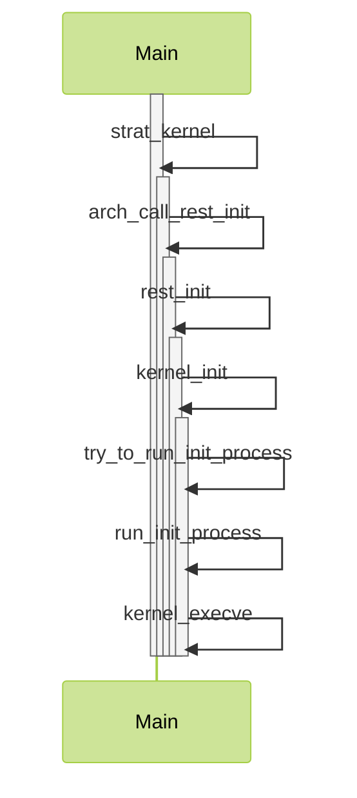

# 【Android系统启动】 Kernel启动流程


## 必要说明

1. Android会在Linux Kenerl基础上做一些Android相关的补充，成为Android Common Kernel（ACK），Android Kernel相关的资料，如Android支持Kernel版本、Kernel发版等信息，可以通过官网[内核概览  | Android 开源项目  | Android Open Source Project (google.cn)](https://source.android.google.cn/docs/core/architecture/kernel?hl=zh-cn)进行查询；
2. 文章Android Kernel基于AOSP官方源码[common-android14-6.1-lts](https://cs.android.com/android/kernel/superproject/+/common-android14-6.1-lts:;bpv=1;bpt=0)进行解读，通过查阅资料得知kernel镜像加载后，在C的入口会通过start_kernel进入，因此将此作为起点；


## 时序图




## 源码解析

### common/init/main.c - start_kernel()

```C++
//  asmlinkage: 这个修饰符通知编译器函数的参数通过堆栈传递，而不是通过寄存器。在许多体系结构中，默认情况下函数参数通过寄存器传递，但是内核函数通常使用堆栈传递参数，因此使用 asmlinkage 修饰符来明确指示这一点。
// __visible: 这个修饰符通知编译器将函数导出为全局符号，以便其他模块可以访问它。在内核中，一些函数需要被其他模块访问，因此使用 __visible 修饰符来明确指示这一点。
// __init: 这个修饰符通知编译器函数在初始化阶段使用，并且在初始化完成后不再需要。在内核中，有些函数只在启动时期间用到，一旦初始化完成就可以释放它们占用的内存，因此使用 __init 修饰符来明确指示这一点。
// __no_sanitize_address: 这个修饰符通知编译器在进行地址检查时不对该函数进行检查。在内核中，由于一些特殊情况和性能要求，可能需要关闭地址检查，因此使用 __no_sanitize_address 修饰符来明确指示这一点。
asmlinkage __visible void __init __no_sanitize_address start_kernel(void)
{
    char *command_line;
    char *after_dashes;

    set_task_stack_end_magic(&init_task);  // 设置任务栈结束标志
    smp_setup_processor_id();  // 设置处理器ID
    debug_objects_early_init();  // 初始化调试对象
    init_vmlinux_build_id();  // 初始化内核的版本信息

    cgroup_init_early();  // 提前初始化控制组

    local_irq_disable();  // 禁用本地中断
    early_boot_irqs_disabled = true;  // 提前禁用引导期间的中断

    /*
     * 中断仍然被禁用。做必要的设置，然后启用中断。
     */
    boot_cpu_init();  // 初始化启动CPU
    page_address_init();  // 初始化页地址
    pr_notice("%s", linux_banner);  // 打印内核版本信息
    early_security_init();  // 提前初始化安全功能
    setup_arch(&command_line);  // 设置体系结构相关参数
    setup_boot_config();  // 设置引导配置
    setup_command_line(command_line);  // 设置内核命令行
    setup_nr_cpu_ids();  // 设置CPU数量
    setup_per_cpu_areas();  // 设置每个CPU的区域
    smp_prepare_boot_cpu();  // 处理启动CPU的特定功能
    boot_cpu_hotplug_init();  // 启动CPU热插拔初始化

    // 更多初始化步骤...
}
这段代码主要负责初始化内核，并启动操作系统的核心功能。


User
帮我写完， 需要全部代码的中文注释
ChatGPT
下面继续注释 start_kernel 函数的代码：

c
Copy code
    build_all_zonelists(NULL);  // 构建所有内存区域列表
    page_alloc_init();  // 初始化页面分配器

    pr_notice("Kernel command line: %s\n", saved_command_line);  // 打印内核命令行
    /* 参数可能设置静态键 */
    jump_label_init();  // 初始化跳转标签
    parse_early_param();  // 解析早期参数
    after_dashes = parse_args("Booting kernel",
                              static_command_line, __start___param,
                              __stop___param - __start___param,
                              -1, -1, NULL, &unknown_bootoption);
    print_unknown_bootoptions();  // 打印未知的引导选项
    if (!IS_ERR_OR_NULL(after_dashes))
        parse_args("Setting init args", after_dashes, NULL, 0, -1, -1,
                   NULL, set_init_arg);
    if (extra_init_args)
        parse_args("Setting extra init args", extra_init_args,
                   NULL, 0, -1, -1, NULL, set_init_arg);

    /* 架构和非时间跟踪 rng 初始化，在分配器初始化之前 */
    random_init_early(command_line);  // 提前初始化随机数生成器

    // 更多初始化步骤...

    /*
     * 这些使用大的 bootmem 分配，并且必须在
     * kmem_cache_init() 之前完成
     */
    setup_log_buf(0);  // 设置日志缓冲区
    vfs_caches_init_early();  // 提前初始化VFS缓存
    sort_main_extable();  // 排序主异常表
    trap_init();  // 初始化陷阱
    mm_init();  // 初始化内存管理
    poking_init();  // 初始化POK功能
    ftrace_init();  // 初始化ftrace

    /* trace_printk 可以在这里启用 */
    early_trace_init();  // 提前初始化跟踪功能

    /*
     * 在启动任何中断（如定时器中断）之前设置调度器。
     * 完整的拓扑设置发生在 smp_init() 时 -
     * 但是在此期间我们仍然有一个功能齐全的调度器。
     */
    sched_init();  // 初始化调度器

    if (WARN(!irqs_disabled(),
             "Interrupts were enabled *very* early, fixing it\n"))
        local_irq_disable();  // 如果在非常早期启用了中断，请修复它

    radix_tree_init();  // 初始化基数树
    maple_tree_init();  // 初始化枫树

    // 更多初始化步骤...

    /* 假设在此后 kmem_cache_init() 之后进行 */
    console_init();  // 初始化控制台
    if (panic_later)
        panic("Too many boot %s vars at `%s'", panic_later,
              panic_param);  // 如果出现过多的启动变量，引发内核恐慌

    lockdep_init();  // 初始化锁依赖

    /*
     * 需要在启用中断时运行此操作，因为它想要自我测试
     * [硬件/软件]-irqs on/off锁反转错误
     */
    locking_selftest();  // 锁定自测

#ifdef CONFIG_BLK_DEV_INITRD
    if (initrd_start && !initrd_below_start_ok &&
        page_to_pfn(virt_to_page((void *)initrd_start)) < min_low_pfn) {
        pr_crit("initrd overwritten (0x%08lx < 0x%08lx) - disabling it.\n",
            page_to_pfn(virt_to_page((void *)initrd_start)),
            min_low_pfn);
        initrd_start = 0;
    }
#endif
    setup_per_cpu_pageset();  // 设置每个CPU的页面集
    numa_policy_init();  // 初始化NUMA策略
    acpi_early_init();  // 提前初始化ACPI
    if (late_time_init)
        late_time_init();  // 如果存在 late_time_init，则进行初始化
    sched_clock_init();  // 初始化调度时钟
    calibrate_delay();  // 校准延迟

	arch_cpu_finalize_init();  // CPU架构初始化的最终化

    pid_idr_init();  // 初始化进程ID分配器
    anon_vma_init();  // 初始化匿名VMA
#ifdef CONFIG_X86
    if (efi_enabled(EFI_RUNTIME_SERVICES))
        efi_enter_virtual_mode();  // 如果启用了EFI运行时服务，进入EFI虚拟模式
#endif
    thread_stack_cache_init();  // 初始化线程堆栈缓存
    cred_init();  // 初始化凭据
    fork_init();  // 初始化fork功能
    proc_caches_init();  // 初始化proc缓存
    uts_ns_init();  // 初始化UTS命名空间
    key_init();  // 初始化密钥
    security_init();  // 初始化安全功能
    dbg_late_init();  // 后期调试功能的初始化
    net_ns_init();  // 初始化网络命名空间
    vfs_caches_init();  // 初始化VFS缓存
    pagecache_init();  // 初始化页面缓存
    signals_init();  // 初始化信号
    seq_file_init();  // 初始化序列文件
    proc_root_init();  // 初始化proc根
    nsfs_init();  // 初始化nsfs
    cpuset_init();  // 初始化cpuset
    cgroup_init();  // 初始化控制组
    taskstats_init_early();  // 提前初始化任务统计

    acpi_subsystem_init();  // 初始化ACPI子系统
    arch_post_acpi_subsys_init();  // ACPI子系统初始化后操作的架构相关初始化
    kcsan_init();  // KCSAN（内核代码静态分析器）的初始化

    /* 执行余下的init函数，现在内核已经活动了 */
    arch_call_rest_init();  // 调用剩余的init函数

    prevent_tail_call_optimization();  // 防止尾调用优化
}

```

可以看到kernel启动的时候，进行了许多环境相关的初始化，如引导CPU、设置缓存、安全信息、内存管理、proc等虚拟文件系统初始化等等；最后再arch_call_rest_init调用其他的init程序；


### common/init/main.c - arch_call_rest_init()

```c
// __init 表示该函数在初始化阶段调用，并且初始化完成后不再需要。
// __weak 表示如果有另一个同名函数被定义为强符号（非弱符号），则使用强符号函数，否则使用当前的弱符号函数。
void __init __weak arch_call_rest_init(void)
{
	rest_init();
}
```

arch_call_rest_init方法只是对rest_init进行了调用。

### common/init/main.c - rest_init()

```c
// 初始化系统的其余部分
noinline void __ref rest_init(void)
{
    struct task_struct *tsk;
    int pid;

    /*
     * 需要先生成init进程，以便它获得pid 1，但是init任务最终会想要创建k线程，
     * 如果我们在创建kthreadd之前安排它，就会发生OOPS。
     */
    // 在用户模式下创建一个线程，执行kernel_init函数
    pid = user_mode_thread(kernel_init, NULL, CLONE_FS);
    /*
     * 将init固定在引导CPU上。在运行sched_init_smp()之前，任务迁移不起作用。
     * 它将为init设置允许的CPU为非隔离CPU。
     */
    rcu_read_lock();
    tsk = find_task_by_pid_ns(pid, &init_pid_ns);
    tsk->flags |= PF_NO_SETAFFINITY;
    set_cpus_allowed_ptr(tsk, cpumask_of(smp_processor_id()));
    rcu_read_unlock();

    // ... 此处省略
}

```

在`rest_init()`函数中，在用户模式下创建一个线程，用于执行`kernel_init`函数，以确保初始化进程获得pid 1。然后将`init`固定在引导CPU上，并设置允许的CPU为非隔离CPU。


### common/init/main.c - kernel_init()

```c
static int __ref kernel_init(void *unused)
{
	int ret;

	/*
	 * 等待kthreadd线程设置完成。
	 */
	wait_for_completion(&kthreadd_done);

	// 进行内核初始化的可释放部分
	kernel_init_freeable();
	/* 需要在释放内存之前完成所有异步 __init 代码 */
	async_synchronize_full();

	system_state = SYSTEM_FREEING_INITMEM;
	kprobe_free_init_mem();
	ftrace_free_init_mem();
	kgdb_free_init_mem();
	exit_boot_config();
	free_initmem();
	mark_readonly();

	/*
	 * 内核映射现在已经最终化 - 更新用户空间页表
	 * 以完成PTI。
	 */
	pti_finalize();

	system_state = SYSTEM_RUNNING;
	numa_default_policy();

	rcu_end_inkernel_boot();

	do_sysctl_args();

	if (ramdisk_execute_command) {
		ret = run_init_process(ramdisk_execute_command);
		if (!ret)
			return 0;
		pr_err("Failed to execute %s (error %d)\n",
		       ramdisk_execute_command, ret);
	}

	/*
	 * 我们尝试每个命令，直到一个成功为止。
	 *
	 * 如果我们尝试恢复一个真正损坏的机器，则可以使用 Bourne shell 代替 init。
	 */
	if (execute_command) {
		ret = run_init_process(execute_command);
		if (!ret)
			return 0;
		panic("Requested init %s failed (error %d).",
		      execute_command, ret);
	}

	if (CONFIG_DEFAULT_INIT[0] != '\0') {
		ret = run_init_process(CONFIG_DEFAULT_INIT);
		if (ret)
			pr_err("Default init %s failed (error %d)\n",
			       CONFIG_DEFAULT_INIT, ret);
		else
			return 0;
	}

	if (!try_to_run_init_process("/sbin/init") ||
	    !try_to_run_init_process("/etc/init") ||
	    !try_to_run_init_process("/bin/init") ||
	    !try_to_run_init_process("/bin/sh"))
		return 0;

	panic("No working init found.  Try passing init= option to kernel. "
	      "See Linux Documentation/admin-guide/init.rst for guidance.");
}
```

这里主要功能包括等待kthreadd线程设置完成、执行内核初始化的可释放部分、完成异步初始化代码、释放初始化内存、最终化内核映射、设置系统状态为运行中等；

然后尝试**执行一系列的init命令（二进制可执行文件），直到找到一个可行的初始化命令为止，**如果都失败，则会触发内核panic。


### common/init/main.c - try_to_run_init_process()

```c
static int try_to_run_init_process(const char *init_filename)
{
	int ret;

	ret = run_init_process(init_filename);

	if (ret && ret != -ENOENT) {
		pr_err("Starting init: %s exists but couldn't execute it (error %d)\n",
		       init_filename, ret);
	}

	return ret;
}

```

`try_to_run_init_process`会进行`run_init_process`的调用，在调用失败的时候打印错误信息。


### common/init/main.c - run_init_process()

```c
static int run_init_process(const char *init_filename)
{
	const char *const *p;

	argv_init[0] = init_filename;
	pr_info("Run %s as init process\n", init_filename);
	pr_debug("  with arguments:\n");
	for (p = argv_init; *p; p++)
		pr_debug("    %s\n", *p);
	pr_debug("  with environment:\n");
	for (p = envp_init; *p; p++)
		pr_debug("    %s\n", *p);
	return kernel_execve(init_filename, argv_init, envp_init);
}
```

这段代码是用于运行初始化进程的函数。通过 `kernel_execve` 函数来执行该程序。在执行之前，打印出了一些要执行的命令和环境变量信息，以便进行调试和跟踪。


## PS

1. 因对整个kernel的知识还未完全掌握，没有解读start_kernel之前的代码流程和kernel_execve执行程序的细节；
2. 文章仅针对从start_kernel到启动Init的进程的流程进行梳理，如有需要补充或者错误的地方，欢迎即使指正；
3. 后续如果笔者能够学会kernel前的知识，如汇编、ld链接脚本等等，再进行补充；对于其他启动，仅做了简单注释；


## 参考

1. [内核概览  | Android 开源项目  | Android Open Source Project (google.cn)](https://source.android.google.cn/docs/core/architecture/kernel?hl=zh-cn)
2. [kernel/superproject - Android Code Search](https://cs.android.com/android/kernel/superproject/+/common-android14-6.1-lts:;bpv=0;bpt=0)
3. [Android启动过程--Kernel启动和init启动_安卓启动逻辑-CSDN博客](https://blog.csdn.net/lvyaer_1122/article/details/130508216)