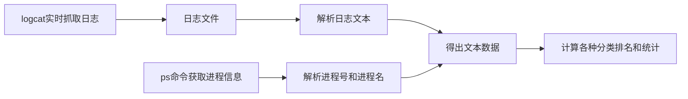

# Android logcat数据统计工具


## 工具背景

> 在Android系统开发中，经常涉及多个模块的集成和开发。各个模块开发，肯定都希望自己的接口等相关日志信息越多越好，避免后面排（扯）查（皮）困难。
>
> 然后不加限制和规范的日志，容易造成logd进程CPU占用高、频繁调用某些接口导致堵塞等系统问题等；
>
> 因此，在性能优化中，Log统计也是必要的一环。对此编写了此python脚本，用于进行Android 日志数据分析。


## 工具实现思路



工具初步构想是通过以下步骤，统计数据：

1. logcat抓取日志文件，将文件保存到本地；
2. 文本分析android logcat 日志，得出时间戳、进程、线程、TAG、行序号、字节大小等；
3. ps定时获取进程信息，如进程号和进程名；
4. 结合文本分析和进程信息，根据进程/TAG等各方面分析，统计打印信息。


## 使用示例

> 初版：直接运行脚本使用，duration处可设置抓取日志的时间，抓取日志完成后会自动分析，打印日志分析结果。

以某手机品牌测试结果如下：

```bash
进程名                                               | 进程号     | 日志等级分配                                          | 总共多少行   | 总共多少字节            | 行数百分比             | 字节百分比             
bastetd                                            | 1016       | I:1, D:0, W:0, E:0, V:0                            | 1          | 120                  | 0.01%                | 0.01%                  
system_server                                      | 1597       | I:1295, D:547, W:149, E:19, V:0                    | 2010       | 239982               | 15.58%               | 17.06%              
[kworker/u17:2]                                    | 1617       | I:0, D:0, W:4, E:0, V:0                            | 4          | 764                  | 0.03%                | 0.05%               
com.android.providers.calendar                     | 16437      | I:26, D:0, W:0, E:18, V:0                          | 44         | 5572                 | 0.34%                | 0.40%              
...
Total                                              | 103        | 12904      | 1406536             
```


## 代码地址

[AndroidScripts/LogStatistics at main · Leung7751/AndroidScripts (github.com)](https://github.com/Leung7751/AndroidScripts/tree/main/LogStatistics)需要的小伙伴可以自取。
