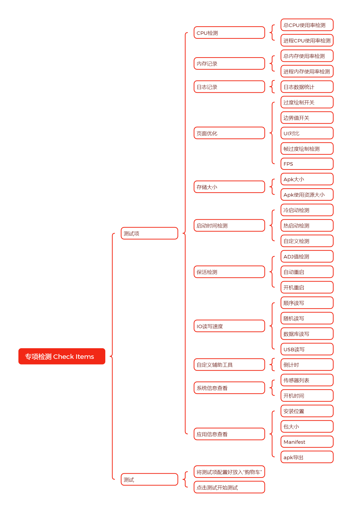
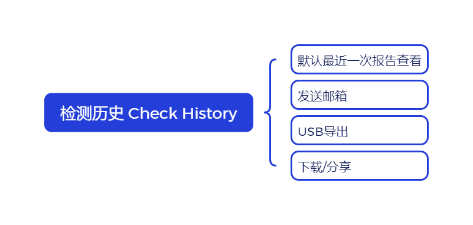

# AndroidCheckAssistant

[TOC]

## 概要设计说明书

#### 目标和背景

#### 修订版本记录

#### 术语表

### 需求说明

#### 需求概述

近几年工作下来，开发过程进行到某个阶段，基本都会进行性能优化处理，这个时候一般需要自己测试性能。因此将相关性能检测的方法，集成到一个apk中，以供开发和测试人员使用。其中功能包括CPU记录、内存记录、日志记录、过度绘制开关、边界值检测、冷热启动时间检测等等功能。

#### 功能清单

#### 非功能性需求

### UX设计

### 设计说明

#### 架构设计

#### 模块设计和实现

#### 性能

暂无

### 异常处理

暂无

#### 系统测试

### 待办项

### 

### 使用手册

